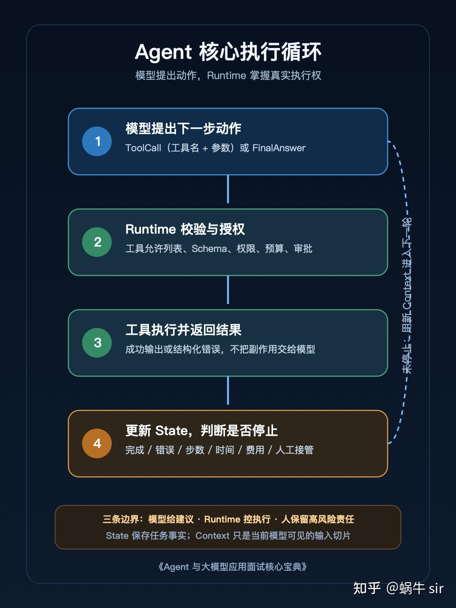

如果面试官问“Agent 是什么”，只回答“会自主思考、规划并调用工具”，通常不够。因为这些词没有说明：下一步由谁决定，工具由谁执行，状态存在哪里，任务怎样停止，失败后谁接管。
本文不做题海，只训练 15 道核心能力题。每题先给可以直接说出口的 30 秒答案，再给展开方向、常见失分点、追问和三级评分。
先声明口径：Agent 在行业里没有唯一公认定义。本文采用工程定义——Agent 是一个带状态、工具和停止条件的执行系统；模型在约束内提出下一步动作，Runtime 校验并执行动作、更新状态，直到任务完成或被外部条件停止。 Anthropic 的工程文章也区分了预定义代码路径驱动的 workflow，与由模型动态决定过程和工具使用的 agent。

怎样使用这 15 道题
每题练两次：
- 30 秒答案：先说结论、核心机制和一个边界；
- 3 分钟展开：补充数据流、失败路径、取舍和例子。
三级评分统一按下面理解：
- 勉强合格：能说出名词和基本定义；
- 合格：能解释组件关系、执行过程和适用边界；
- 优秀：还能给出失败路径、验证方法、替代方案或生产约束。
一、Agent 与工作流：先讲清控制权
1. Agent 到底是什么？
考察点： 能否把 Agent 落到可执行系统，而不是使用“自主、智能、规划”堆形容词。
30 秒答案： Agent 是由模型、Runtime、工具、状态和停止条件组成的执行系统。模型根据当前上下文提出下一步动作，Runtime 决定动作能否执行，把工具结果写回状态，再进入下一轮，直到完成或触发停止条件。
3 分钟展开： 至少说明四步：模型产生 ToolCall 或最终答案；Runtime 校验工具名和参数；工具执行结果回填；Runtime 根据完成、错误、步数、时间或预算决定继续还是停止。模型不是操作系统，也不应直接拥有生产权限。
失分与追问： 只说“会思考和调用工具”会被追问：谁执行工具？状态在哪里？怎样防止无限循环？
评分： 勉强合格只讲模型加工具；合格讲清循环与停止；优秀还能区分模型决策权、Runtime 执行权和人的审批权。
2. Agent 与固定工作流有什么区别？
30 秒答案： 固定工作流的主要路径由代码预先定义；Agent 的部分路径由模型根据当前状态动态选择。两者都可以调用模型和工具，区别在于控制流由谁决定。
3 分钟展开： 如果任务步骤稳定、输入类型明确、错误成本高，固定工作流通常更可预测；如果任务需要在运行中根据新信息选择工具和步骤，Agent 才有价值。生产系统经常是混合形态：外层工作流限定阶段，局部 Agent 处理不确定步骤。
失分与追问： 把“用了 LLM”当成 Agent；或者认为 Agent 一定优于工作流。追问通常是：退款审批、知识问答、故障分析分别选什么？
评分： 勉强合格能说预定义与动态；合格能按任务不确定性选择；优秀能提出混合架构和人工接管边界。
3. 使用大模型并注册几个工具，就算 Agent 吗？
30 秒答案： 不一定。如果代码始终按固定顺序调用模型和工具，它更接近带模型能力的工作流。只有当模型能在约束内根据状态选择下一步动作，系统才符合本文的 Agent 工程定义。
3 分钟展开： 判断时看三个问题：下一步动作是否动态；工具选择是否依赖运行时信息；系统是否维护跨步骤状态和停止条件。工具数量不是判断标准，一个工具也可以形成 Agent，十个工具也可能只是固定流水线。
失分与追问： 用框架类名代替机制。追问会让你画出一次请求从输入到结束的控制流。
评分： 勉强合格说“不一定”；合格给出三项判断；优秀能用具体系统画出控制权分布。
4. 模型和 Agent Runtime 分别负责什么？
30 秒答案： 模型负责基于上下文提出动作或答案；Runtime 负责工具暴露、参数校验、权限、执行、状态、错误、日志和停止。模型给建议，Runtime 掌握真实副作用。
3 分钟展开： 模型可以输出“调用 get_ticket”，但 Runtime 要检查工具是否允许、参数是否符合 Schema、调用是否超时、结果是否可写回、失败是否重试。涉及写操作时，还要经过身份、策略或人工审批。
失分与追问： 说“模型调用数据库”。追问是：数据库凭据放哪里？模型输出非法参数怎么办？
评分： 勉强合格能区分模型和程序；合格能列出 Runtime 职责；优秀能解释执行权为什么必须留在确定性边界内。
二、Tool Calling：不是函数列表，而是执行协议
5. Tool Calling 是什么？
30 秒答案： Tool Calling 是模型输出结构化工具调用意图，Runtime 根据工具契约执行并把结果返回给模型的协议。它不是模型直接运行函数。
3 分钟展开： 一个调用至少包含工具名和参数；一个工具至少需要名称、描述和输入 Schema。MCP 的工具规范也使用 name、description、inputSchema 描述工具，并通过工具名和参数发起调用。[2]
失分与追问： 把 Tool Calling 说成“让模型联网”。追问是：工具结果由谁追加到上下文？
评分： 勉强合格知道结构化调用；合格讲清模型—Runtime—工具—结果回填；优秀还能说明权限、超时和审计位置。
6. 为什么工具需要 Schema？
30 秒答案： Schema 用来约束参数名称、类型、必填项和结构，使模型输出可以被机器校验，而不是把自然语言直接交给业务接口。
3 分钟展开： Schema 同时服务三方：模型据此生成参数，Runtime 据此拒绝非法输入，测试据此覆盖边界。但 Schema 只能验证结构，不能自动证明业务权限、数据合法性或操作幂等。
失分与追问： 认为有 Schema 就安全。追问是：金额为负、用户越权、重复提交分别在哪一层处理？
评分： 勉强合格说类型校验；合格区分结构校验与业务校验；优秀能补充权限、幂等和错误语义。
7. 工具调用失败后，Agent 应该怎么处理？
30 秒答案： 先把错误分类并记录到状态，再决定重试、换工具、请求补充信息、降级或人工接管，不能对所有错误无脑重试。
3 分钟展开： 参数错误通常应让模型修正；临时网络错误可以有限重试；权限拒绝不应重试绕过；未知工具说明模型与注册表不一致；写操作超时要先确认是否已经成功，再决定是否重试。
失分与追问： 只回答“加重试”。追问通常是：支付接口超时能直接重试吗？
评分： 勉强合格知道捕获异常；合格能按错误类型选择动作；优秀能说明幂等、状态确认和人工接管。
8. Agent 怎样停止，怎样避免死循环？
30 秒答案： Runtime 必须设置多种停止条件：模型给出最终答案、达到任务终态、超过步数、时间、Token 或费用预算、连续错误，或触发人工接管。
3 分钟展开： 不应只依赖模型输出“完成”。本项目最小 Runtime 使用 max_steps，当模型持续调用工具而不结束时，系统会返回 max_steps_exceeded。生产系统还应限制重复动作、检测无状态进展并支持取消。
失分与追问： 只说设置最大轮数。追问是：长任务如何避免被固定轮数误杀？
评分： 勉强合格知道最大步数；合格能列出多维预算；优秀能解释检查点、进展检测和外部取消。
三、State 与 Context：决定任务会不会越跑越乱
9. Agent State 与 Context 有什么区别？
30 秒答案： State 是任务事实、执行位置、工具结果和控制信息的持久记录；Context 是当前一次模型调用可见的输入切片。State 属于 Runtime，Context 为模型服务。
3 分钟展开： 一个工单状态、已批准动作和幂等键必须可靠保存，但不一定每轮全部发给模型。Runtime 根据任务阶段，从 State 选择必要内容组成 Context。这样既能裁剪 Token，也不会因为裁剪对话而丢掉业务事实。
失分与追问： 把两个词都解释成“聊天历史”。追问是：进程重启后从哪里恢复？
评分： 勉强合格知道两者不同；合格能说生命周期与所有权；优秀能解释检查点、裁剪和恢复。
10. 聊天记录等于 Agent State 吗？
30 秒答案： 不等于。聊天记录只是交互事件的一部分，State 还包括任务 ID、当前阶段、结构化事实、工具结果、审批、错误、预算和幂等信息。
3 分钟展开： 如果只保存聊天记录，恢复时需要重新从自然语言推断业务状态，容易重复执行。更可靠的方式是把消息、业务状态和执行控制分开保存，再按需要组装上下文。
失分与追问： 认为把所有消息存数据库就完成了持久化。追问是：怎样判断某个写工具已经执行过？
评分： 勉强合格知道还有元数据；合格能列出结构化状态；优秀能说明事件、快照和幂等记录的关系。
11. RAG、长期记忆和缓存有什么区别？
30 秒答案： RAG 从外部知识中检索当前任务需要的材料；长期记忆保存跨任务可复用的信息；缓存复用相同或近似计算结果。它们的数据来源、生命周期和失效规则不同。
3 分钟展开： RAG 关注“这次回答需要什么证据”；长期记忆关注“以后是否应记住这个用户或任务事实”；缓存关注“这个结果能否不重新计算”。业务状态又是第四类：它记录当前任务真实进度，不能被前三者替代。
失分与追问： 把向量数据库统一叫“记忆层”。追问是：用户权限变化后，检索结果和缓存怎样失效？
评分： 勉强合格能区分用途；合格能说明生命周期；优秀能补充权限、更新和失效策略。
12. 上下文窗口足够长后，还需要 State 吗？
30 秒答案： 需要。长上下文扩大了模型一次能看到的信息，但不能替代事务状态、权限、幂等、检查点和可查询的结构化任务记录。
3 分钟展开： 上下文可能被裁剪、压缩或重新组装，模型也可能忽略其中信息。生产系统必须由确定性存储回答“执行到哪一步、哪些动作已确认、还能花多少预算”，而不是每次让模型从长文本重新推断。
失分与追问： 认为 Token 足够就不需要数据库。追问是：服务重启或并发执行时怎样保证一致性？
评分： 勉强合格说长上下文不是数据库；合格能列出结构化状态；优秀能解释一致性、恢复和并发控制。
四、测试与生产边界：把“会跑”变成“可交付”
13. Agent 应该怎样测试？
30 秒答案： 分层测试。单元测试用 fake model 固定动作，覆盖成功、失败和边界；集成测试验证真实工具与状态；端到端评测再使用真实模型和任务集。
3 分钟展开： 本项目的最小示例用脚本化模型固定动作序列，已经验证成功工具调用、未知工具错误和步数上限，并在 Python 3.8.6 与 3.13.5 上得到一致结果。这样可以先验证 Runtime，再单独评估模型不确定性。
失分与追问： 只说“多准备一些 Prompt 测试”。追问是：模型每次输出不同，CI 怎样稳定？
评分： 勉强合格知道要测试工具；合格能分层并使用 fake model；优秀能设计步骤断言、数据集和回归门。
14. 一个能调用工具的 Demo，距离生产 Agent 还缺什么？
30 秒答案： 至少还缺持久状态、重试与幂等、权限与审批、可观测性、评测、安全、成本预算、并发控制和人工接管。
3 分钟展开： Demo 证明控制流能走通，不证明任务可以恢复、写操作不会重复、越权动作会被拒绝、失败可以定位、升级后不会回归，也不证明成本和延迟满足业务要求。
失分与追问： 只回答“部署和扩容”。追问是：工具已成功但响应超时时，怎样防止重复写？
评分： 勉强合格列出日志和数据库；合格覆盖可靠性、权限、评测和成本；优秀能把每项能力映射到具体失败场景。
15. 为什么 Agent 评测不能只看最终答案？
30 秒答案： 因为相同最终答案可能来自不同过程。Agent 还要评估是否选对工具、参数是否正确、是否引用了正确知识、是否重复执行、是否越权，以及成本和延迟是否可接受。
3 分钟展开： 最终答案正确但调用了禁止工具，系统仍不合格；最终答案暂时正确但步骤不可复现，也容易在下一版本回归。评测应同时包含任务级结果和步骤级断言，并保留 Trace 供失败分析。
失分与追问： 只说“看准确率”。追问是：没有唯一标准答案的任务怎么评？
评分： 勉强合格知道过程也重要；合格能列出步骤指标；优秀能说明规则断言、模型评分、人评和业务指标怎样分工。

---

# 小白友好版：15 道题逐题精讲（补充篇）

> **上篇**是"考试视角"的紧凑版：30 秒答案 + 展开方向 + 失分点，适合考前快速过。
> **本篇**是"教学视角"的展开版：假设你刚接触 Agent，每题按**十步模板**讲透，零基础也能完全读懂。
> **建议用法**：先自己试着回答 → 对照 30 秒答案 → 看图解和例子 → 最后做"自测三问"，三问都能答上来才算真懂。

## 先说清楚：每道题的"优秀模板"长什么样

本篇所有题目都按同一个模板组织，这也是你以后自己整理任何面试题可以复用的模板：

| 步骤 | 板块 | 作用 |
| --- | --- | --- |
| ① | 一句话人话 | 先给结论，让大脑有个"挂钩" |
| ② | 生活类比 | 用熟悉的事物建立直觉 |
| ③ | 前置知识 | 补齐听懂答案所需的术语 |
| ④ | 30 秒口播答案 | 面试直接说出口的版本 |
| ⑤ | 图解展开 | 看清数据流和控制流 |
| ⑥ | 完整例子 | 用具体数据走一遍全流程 |
| ⑦ | 常见误区 | 小白最容易理解错的地方 |
| ⑧ | 追问与应对 | 面试官下一句会问什么 |
| ⑨ | 评分对照 | 看自己处在哪一档 |
| ⑩ | 自测三问 | 检验"以为自己懂了"还是"真懂了" |

**为什么这个模板有效**：先结论（挂钩）→ 再类比（直觉）→ 再机制（精确）→ 再例子（落地）→ 最后自测（闭环）。缺任何一环，面试时都容易"背出来了但没懂"。

---

## 第一题精讲：Agent 到底是什么？

### ① 一句话人话

Agent 是一个"给目标就能自己干活的程序"：你告诉它要什么，它自己一步步决定怎么干、干到哪一步算完。

### ② 生活类比

把 Agent 想成一个**包车司机**：

* 你只说目的地（目标），不说每一步怎么转弯（步骤不写死）
* 司机自己看路况决定走哪条路（模型动态决策）
* 司机手里有方向盘和油门（工具）
* 仪表盘显示到哪了、油还剩多少（状态）
* 到达目的地或没油了就停（停止条件）

而"固定工作流"像**跟团游**：行程表提前打印好，几点上车、几点拍照全定死，导游不问你意见。

### ③ 前置知识（小白先补这几个词）

* **LLM（大模型）**：像 ChatGPT 这样的模型，本质是"读一段文字、生成下一段文字"，它自己**不会**执行任何操作
* **工具（Tool）**：一段真实可运行的程序（查天气、查数据库、发邮件），模型只能"请求调用"
* **Runtime（运行时）**：包裹模型的工程代码，负责真正执行工具、记录状态、判断停不停
* **状态（State）**：任务进行到哪一步的记录本
* **停止条件**：什么时候算干完、或必须停下来

### ④ 30 秒口播答案

"Agent 是由模型、Runtime、工具、状态和停止条件组成的执行系统。模型根据当前上下文提出下一步动作；Runtime 决定这个动作能不能执行，执行后把工具结果写回状态，再进入下一轮，直到任务完成或触发停止条件。"

### ⑤ 图解展开

```
          ┌──────────────── Agent 循环 ────────────────┐
          │                                           │
 目标 ──▶ 模型(思考) ──▶ 提出动作: 调用工具 X          │
          │                    │                      │
          │                    ▼                      │
          │       Runtime 校验(权限/参数/预算)          │
          │                    │                      │
          │                    ▼                      │
          │               执行工具 X                  │
          │                    │                      │
          │                    ▼                      │
          │       结果写回状态 ──▶ 模型看新状态 ─────────┘
          │
          └──▶ 满足停止条件 ──▶ 输出最终答案
```

| 角色 | 职责 | 一句话 |
| --- | --- | --- |
| 模型 | 决定下一步做什么 | 参谋 |
| Runtime | 校验、执行、记录 | 执行官 |
| 工具 | 产生真实效果 | 手和脚 |
| 状态 | 记录进度 | 账本 |

### ⑥ 完整例子走一遍

任务：查"北京明天的天气，下雨就提醒带伞"。

```
第 1 轮:
  模型看到: 任务目标
  模型输出: 我要调用 get_weather(city='北京')
  Runtime:  校验通过 → 执行 → 得到 { temp: 18, rain: true }
  写回状态: 天气已查到，有雨

第 2 轮:
  模型看到: 目标 + 天气结果
  模型输出: 不再调用工具，给出最终答案:
           "北京明天 18 度有雨，记得带伞"
  Runtime:  模型给出最终答案 → 停止条件满足 → 任务结束
```

注意：模型没有"打开天气网站"的能力，它只是**说出想调用的工具**，真正执行的是 Runtime。

### ⑦ 小白常见误区

* ❌ "Agent 就是 ChatGPT" → ✅ 模型只是 Agent 的"大脑"零件
* ❌ "Agent 会自己执行代码" → ✅ 模型只产生意图，执行永远由 Runtime 完成
* ❌ "有工具的聊天机器人就是 Agent" → ✅ 还要看：下一步是否由模型动态决定、有没有状态和停止条件

### ⑧ 追问与应对

* 追问："谁执行工具？" → 答：Runtime 执行，模型只提出调用意图
* 追问："状态存在哪？" → 答：Runtime 管理的持久化存储，不只是聊天记录
* 追问："怎么防止死循环？" → 答：步数/时间/预算多维停止条件 + 重复动作检测

### ⑨ 评分对照

* 勉强合格：只讲"模型 + 工具"
* 合格：讲清循环（模型提出 → Runtime 执行 → 结果回填）与停止条件
* 优秀：还能区分三种权力——**模型决策权、Runtime 执行权、人的审批权**

### ⑩ 自测三问

1. 模型输出"我要调用搜索工具"之后，是谁真正去执行的？
2. 如果模型永远不输出最终答案，系统靠什么停下来？
3. 为什么说"模型给建议，Runtime 掌握真实副作用"？

---

## 第二题精讲：Agent 与固定工作流有什么区别？

### ① 一句话人话

固定工作流的步骤是**人提前写死**的；Agent 的步骤是**模型边跑边决定**的——区别就在"下一步听谁的"。

### ② 生活类比

* **固定工作流 = 跟团游**：行程表打印好，8 点集合、9 点拍照、12 点吃饭，遇到下雨也照走
* **Agent = 包车自由行**：司机根据天气、堵车、你的心情临时改路线
* **混合形态 = 半自助游**：大框架（去哪几个城市）定死，城市内怎么玩司机灵活安排——生产系统大多是这种

### ③ 前置知识

* **控制流**：程序执行路径由谁决定
* **确定性**：同样输入是否永远走同样的路径
* **DAG**：有向无环图，常用来描述工作流的固定步骤

### ④ 30 秒口播答案

"固定工作流的主要路径由代码预先定义；Agent 的部分路径由模型根据当前状态动态选择。两者都可以调用模型和工具，核心区别是控制流由谁决定。"

### ⑤ 图解展开

```
固定工作流:  步骤1 ──▶ 步骤2 ──▶ 步骤3        (路径写死)
                  │
                  └─ 条件分支也提前写死

Agent:      模型 ──▶ 下一步是? ──▶ 看当前状态决定
              ▲                       │
              └──── 结果回填后重新决策 ─┘
```

选择标准一句话：**步骤稳定选工作流，路径未知用 Agent**。

### ⑥ 完整例子走一遍

| 任务 | 选型 | 原因 |
| --- | --- | --- |
| 退款审批 | 固定工作流 | 规则明确（金额判断→风控→打款），错误成本高，要可预测 |
| 知识问答（FAQ） | RAG / 工作流 | 检索→生成两步固定，不需要动态决策 |
| 线上故障分析 | Agent | 故障原因未知：可能要看日志、可能要查监控、可能要查发布记录——路径无法预写 |

生产常见混合形态：**外层工作流限定阶段（受理→分析→处置→复盘），"分析"阶段内部是个 Agent**。

### ⑦ 小白常见误区

* ❌ "用了 LLM 就是 Agent" → ✅ 工作流里也可以调 LLM（比如固定先摘要再分类），那不是 Agent
* ❌ "Agent 一定比工作流先进" → ✅ Agent 牺牲了可预测性换灵活性，规则明确的场景反而是倒退
* ❌ "Agent 就是聊天机器人" → ✅ 聊天机器人没有"多步执行直到目标完成"的循环

### ⑧ 追问与应对

* 追问："退款审批、知识问答、故障分析分别选什么？" → 答：工作流 / RAG 管线 / Agent（按不确定性排）
* 追问："为什么 Agent 更难测试？" → 答：路径不确定，无法穷举分支，要靠轨迹评测

### ⑨ 评分对照

* 勉强合格：能说"预定义 vs 动态"
* 合格：能按任务不确定性选型
* 优秀：能提出**混合架构**（工作流骨架 + 局部 Agent）和**人工接管边界**

### ⑩ 自测三问

1. 一个系统固定执行"翻译→总结→打分"三步，每步都调 LLM，它是 Agent 吗？为什么？
2. 什么特征的任务才值得用 Agent？
3. 说说你知道的"外层工作流 + 内层 Agent"的例子。

---

## 第三题精讲：使用大模型并注册几个工具，就算 Agent 吗？

### ① 一句话人话

不一定——**关键不看有没有工具，而看"下一步由谁决定"**：代码写死顺序就还是工作流，模型能临场选路才是 Agent。

### ② 生活类比

* 家里有**整套工具箱 ≠ 会修水管的师傅**——工具是能力，还要看有没有人根据情况决定先用哪个
* **全自动洗衣机**：有传感器（输入信息），但程序固定（浸泡→洗涤→甩干），它是"带反馈的固定流程"，不是师傅
* **上门维修工**：看到实际情况决定先关阀门还是先拆管子——这才是"动态决策"

### ③ 前置知识

* **注册工具**：把工具定义（名字/描述/参数）提供给模型
* **动态决策**：下一步动作依赖运行时才知道的信息（上一步结果、数据内容）

### ④ 30 秒口播答案

"不一定。如果代码始终按固定顺序调用模型和工具，它更接近带模型能力的工作流；只有当模型能在约束内根据状态选择下一步动作，才是 Agent。"

### ⑤ 图解展开

判断三问（面试直接用）：

```
1. 下一步动作是动态的吗？（还是代码写死？）
2. 工具选择依赖运行时信息吗？（看上一步结果才决定？）
3. 有跨步骤状态和停止条件吗？
```

**工具数量不是标准**：1 个工具可以构成 Agent（模型决定何时用/不用）；10 个工具按固定顺序跑也只是流水线。

### ⑥ 完整例子走一遍

```
反例（不是 Agent）:
  代码写死: ①调用模型翻译 → ②调用模型总结 → ③调用打分接口
  每一步执行与否由代码决定，模型只加工文本

正例（是 Agent）:
  模型第 1 步: 看到用户问题含专业术语 → 决定先调用 search 工具
  模型第 2 步: 看到搜索结果不够 → 换关键词再调一次 search
  模型第 3 步: 信息够了 → 决定不再调用工具，直接输出答案
  （要不要查、查几次、何时停，都由模型看状态决定）
```

### ⑦ 小白常见误区

* ❌ "调用了 LangChain/XxxAgent 类就是 Agent" → ✅ 框架类名≠机制，要看控制流实际由谁决定
* ❌ "工具越多越 Agent" → ✅ 一个工具也能是 Agent，十个工具也可能只是流水线

### ⑧ 追问与应对

* 追问："画出一次请求从输入到结束的控制流" → 按第五题图解画：模型→Runtime→工具→回填→循环
* 追问："你们的系统算 Agent 吗？" → 用判断三问对照实际系统回答

### ⑨ 评分对照

* 勉强合格：说"不一定"
* 合格：给出三项判断标准
* 优秀：能用具体系统画出**控制权分布图**（哪几步代码决定、哪几步模型决定）

### ⑩ 自测三问

1. 判断"是不是 Agent"的核心标准是什么？
2. 一个系统只在最后一步让模型决定"回复用户还是转人工"，算 Agent 吗？（算，至少该步是动态决策）
3. 为什么说工具数量不能作为判断标准？

---

## 第四题精讲：模型和 Agent Runtime 分别负责什么？

### ① 一句话人话

模型是**动嘴的参谋**（提出下一步做什么），Runtime 是**动手的执行官**（校验、执行、记录、兜底）——真实世界的副作用永远握在 Runtime 手里。

### ② 生活类比

* 模型 = **导航软件**：建议走三环，避开拥堵
* Runtime = **你开车**：看导航建议，但最终踩不踩油门、要不要闯红灯（不行！）由你决定
* 导航说"前方掉头"你就无条件掉头吗？——遇到单行道、禁左，你会拦下来。Runtime 对模型动作的校验就是这些"交通规则"

### ③ 前置知识

* **副作用**：对真实世界产生的影响（改数据、发钱、发邮件）
* **凭据（Credential）**：数据库密码、API Key——给程序用的身份证
* **Schema 校验**：检查参数名字、类型对不对

### ④ 30 秒口播答案

"模型负责基于上下文提出动作或答案；Runtime 负责工具暴露、参数校验、权限、执行、状态、错误、日志和停止。一句话：模型给建议，Runtime 掌握真实副作用。"

### ⑤ 图解展开

模型说"调用 get_ticket"之后，Runtime 要过 **6 道关**：

```
模型输出: 调用 get_ticket(order_id='A123')

Runtime:
  ① 工具存在吗？      → get_ticket 在注册表里吗
  ② 参数合法吗？      → order_id 是字符串且非空吗（Schema）
  ③ 有权限吗？        → 当前用户能查这个订单吗（业务策略）
  ④ 预算够吗？        → 步数/费用/时间还剩吗
  ⑤ 执行与超时        → 调用真实接口，设置超时
  ⑥ 结果与错误处理     → 成功回填上下文；失败分类处理（见第七题）
```

### ⑥ 完整例子走一遍

模型输出：`update_user_role(user_id=9527, role='admin')`（把某用户提成管理员）。

Runtime 逐关检查：

```
① 工具存在 ✅
② 参数合法 ✅
③ 权限检查 ❌ —— 当前操作者是普通客服，没有提权权限
   → 拒绝执行，向模型返回"权限不足，此操作需要管理员审批"
   → 或者转人工审批队列
```

这就是"执行权留在确定性边界内"——**再聪明的模型也不能自己给自己发权限**。

### ⑦ 小白常见误区

* ❌ "模型直接调用数据库" → ✅ 模型只输出调用意图，数据库连接、SQL 执行都在 Runtime
* ❌ "把数据库密码告诉模型，让它自己连" → ✅ 凭据只放 Runtime/密钥管理系统，模型上下文里绝不能出现（模型"看见"的都可能被说出来）
* ❌ "模型输出非法参数会崩溃" → ✅ Runtime 负责拦截并把错误信息回传，让模型修正

### ⑧ 追问与应对

* 追问："数据库凭据放哪里？" → 答：环境变量/密钥管理服务，由 Runtime 注入工具执行，永不进模型上下文
* 追问："模型输出非法参数怎么办？" → 答：Schema 校验拒绝 + 错误回传模型自我修正（限次）

### ⑨ 评分对照

* 勉强合格：能区分"模型"和"程序"
* 合格：能列出 Runtime 职责清单
* 优秀：能解释**执行权为什么必须留在确定性边界内**（防止幻觉/注入直接变成真实事故）

### ⑩ 自测三问

1. 模型输出一个工具调用后，Runtime 至少要做哪几件事？
2. 为什么凭据不能出现在模型上下文里？
3. "模型给建议，Runtime 掌握副作用"——用你自己的话解释这句话。

---
## 第五题精讲：Tool Calling 是什么？

### ① 一句话人话

Tool Calling 是"**模型点菜、厨房做菜、菜端回桌上**"的协议：模型输出结构化的调用请求，Runtime 真正执行，结果再返回给模型看。

### ② 生活类比

餐厅点菜：

* 你（模型）在菜单上勾选：宫保鸡丁、微辣、少油（**结构化参数**）
* 服务员把单子递给厨房（Runtime **转交**执行）
* 厨房做好，端上桌（结果**回填上下文**）
* 你看到菜后决定：够吃了（结束）还是再点一道（下一轮）

关键：**你从头到尾没进过厨房**——模型从不执行任何工具。

### ③ 前置知识

* **结构化输出**：按规定格式（如 JSON）输出，机器能直接解析
* **上下文（Context）**：模型当前能看到的所有信息（对话历史、工具结果等）
* **工具契约**：工具名 + 描述 + 参数 Schema 组成的"接口说明书"

### ④ 30 秒口播答案

"Tool Calling 是模型输出结构化的工具调用意图，Runtime 根据工具契约执行并把结果返回给模型的协议。它不是模型直接运行函数。"

### ⑤ 图解展开

```
上下文(含工具定义)
      │
      ▼
   模型生成
      │
      ├─▶ 情况A: tool_call { name: 'search', args: { q: '...' } }
      │        │
      │        ▼
      │   Runtime 解析 → 校验 → 执行 → tool_result 追加进上下文
      │        │
      │        ▼
      │   模型看到结果，进入下一轮
      │
      └─▶ 情况B: 直接输出最终答案(无 tool_call) → 循环结束
```

### ⑥ 完整例子走一遍

用户问："帮我查下 9527 号订单的状态"

```
消息流(上下文的样子):
[1] user:      帮我查下 9527 号订单的状态
[2] assistant: 我来查询订单 (tool_call: get_order / { id: '9527' })
[3] tool:      { status: '已发货', eta: '明天' }        ← Runtime 执行后回填
[4] assistant: 您的订单已发货，预计明天送达。              ← 模型基于[3]生成
```

四个角色各自出手的位置：模型出的[2]，Runtime 执行产生的[3]，模型再出[4]。

### ⑦ 小白常见误区

* ❌ "Tool Calling 就是让模型联网" → ✅ 联网只是众多工具中的一种（搜索工具）
* ❌ "模型执行了函数" → ✅ 模型只输出"想调用什么"，执行者是 Runtime
* ❌ "工具结果模型自动知道" → ✅ 结果必须由 Runtime 追加到上下文，模型才能"看见"

### ⑧ 追问与应对

* 追问："工具结果由谁追加到上下文？" → 答：Runtime，以 tool 消息角色回填并对应 tool_call_id
* 追问："模型输出的 JSON 格式错了怎么办？" → 答：Schema 校验拦截 + 错误回传重试（限次）/ 用约束解码保证格式

### ⑨ 评分对照

* 勉强合格：知道"结构化调用"
* 合格：讲清**模型 → Runtime → 工具 → 结果回填**的完整链路
* 优秀：还能说明权限校验、超时控制、审计日志在链路的哪个位置

### ⑩ 自测三问

1. 模型输出 tool_call 后到它"看见"结果之间，发生了什么？
2. 如果 Runtime 不把结果写回上下文，会发生什么？
3. 为什么说 Tool Calling 是"协议"而不是"能力"？

---

## 第六题精讲：为什么工具需要 Schema？

### ① 一句话人话

Schema 是工具的**点餐表格**：规定必须填什么字段、什么类型、可选项有哪些——没有表格，厨房没法接单，程序没法校验。

### ② 生活类比

奶茶店点单：

* 表格：杯型（中/大，必填）、糖度（无糖~全糖，枚举）、温度（去冰/常温/热，枚举）
* 没有表格时顾客说"来杯差不多甜、稍微凉的"——店员只能猜
* 有了表格：选项固定、必填明确，**机器可以直接校验**（没填杯型 → 拒单）

模型也一样：没有 Schema，它可能编造参数名；有了 Schema，参数必须"对得上表格"。

### ③ 前置知识

* **JSON Schema**：描述 JSON 数据结构的标准（字段名、类型、必填、枚举值）
* **类型校验**：字符串/数字/布尔，传错类型直接拒绝
* **枚举**：限定只能从几个固定值里选

### ④ 30 秒口播答案

"Schema 约束参数的名称、类型、必填项和结构，让模型输出可以被机器校验，而不是把自然语言直接交给业务接口。"

### ⑤ 图解展开

Schema 同时服务**三方**：

```
        ┌──▶ 模型: 照着 Schema 生成参数(知道该填什么)
Schema ─┼──▶ Runtime: 照着 Schema 拒绝非法输入(机器校验)
        └──▶ 测试: 照着 Schema 构造边界用例(漏填/错类型/超长)
```

**重要边界**：Schema 只验证**结构**（名字、类型对不对），验证不了**业务**（金额是否为负、用户是否有权、是否重复提交）——那是 Runtime 策略层的事。

### ⑥ 完整例子走一遍

```json
{
  "name": "create_refund",
  "parameters": {
    "type": "object",
    "properties": {
      "order_id":  { "type": "string" },
      "reason":    { "type": "string" },
      "channel":   { "type": "string", "enum": ["original", "balance"] }
    },
    "required": ["order_id", "reason"]
  }
}
```

```
模型输出A: { order_id: '9527', reason: '质量问题' }        → 结构合法 ✅
模型输出B: { order_id: 9527 }                              → 类型错+缺reason ❌ 拒绝并回传错误
模型输出C: { order_id: '9527', channel: 'alipay_hack' }    → 不在枚举内 ❌
```

### ⑦ 小白常见误区

* ❌ "有了 Schema 就安全了" → ✅ 金额为负（业务校验）、越权（权限层）、重复提交（幂等层）都拦不住
* ❌ "Schema 写得越严越好" → ✅ 过度约束会让合法调用被误杀；必填项要最小化

### ⑧ 追问与应对

* 追问："金额为负、用户越权、重复提交分别在哪层处理？" → 答：业务策略层 / 权限层 / 幂等层（都不在 Schema 层）
* 追问："Schema 变了怎么兼容？" → 答：版本化 + 向后兼容（新增字段可选，不删旧字段）

### ⑨ 评分对照

* 勉强合格：说"类型校验"
* 合格：区分**结构校验**与**业务校验**
* 优秀：补充权限、幂等、错误语义设计

### ⑩ 自测三问

1. Schema 能防住"模型编造参数名"吗？能防住"越权访问"吗？（能/不能，为什么）
2. Schema 服务于哪三方？
3. 枚举类型的参数有什么好处？

---

## 第七题精讲：工具调用失败后，Agent 应该怎么处理？

### ① 一句话人话

先把错误**分类**，再对症下药——就像外卖失败要分清是"地址写错"（改地址）、"路上堵"（等一等）还是"店关门"（换一家），不能一律重试。

### ② 生活类比

| 外卖失败原因 | 对应处理 | Agent 里的错误类型 |
| --- | --- | --- |
| 地址写错，骑手联系你 | 改了地址重新送 | **参数错误** → 回传错误让模型修正 |
| 路上堵车晚到 | 稍等片刻 | **临时故障** → 有限重试（退避） |
| 店家关门 | 换一家店点 | **工具不可用** → 换工具/降级 |
| 大额订单出问题 | 打客服热线人工处理 | **高危/未知** → 人工接管 |

### ③ 前置知识

* **重试（Retry）**：失败后再调一次；只对"临时性错误"有意义
* **幂等（Idempotent）**：同一操作做一次和做多次结果相同（查天气幂等；扣款不幂等）
* **超时（Timeout）**：调用超过限定时间就放弃等待

### ④ 30 秒口播答案

"先把错误分类并记录到状态，再决定重试、换工具、请求补充信息、降级或人工接管，不能对所有错误无脑重试。"

### ⑤ 图解展开

错误分类决策树：

```
工具失败
  ├─ 参数/Schema 错误 ──────▶ 错误信息回传模型，让它修正(限 2 次)
  ├─ 临时网络/限流错误 ─────▶ 指数退避重试(1s→2s→4s，最多 3 次)
  ├─ 权限拒绝 ────────────▶ 不重试！转审批或告知模型换路径
  ├─ 未知工具 ────────────▶ 模型与注册表不一致，告警+修正注册
  ├─ 工具永久不可用 ────────▶ 降级方案或换工具
  └─ 写操作超时 ──────────▶ 先查"是否已成功"，再决定能否重试 ⚠️
```

### ⑥ 完整例子走一遍

高危陷阱题：**支付接口超时，能直接重试吗？**

```
❌ 直接重试: 可能第一次其实已扣款成功(只是响应没回来) → 重复扣款
✅ 正确姿势:
   1. 用订单号/幂等键先调 pay_query 查询该笔支付的真实状态
   2. 已成功  → 当作成功继续，不重试
   3. 确认失败 → 才重新发起支付(且带上同一个幂等键)
```

这就是"写操作超时要先确认状态，再决定重试"的含义。

### ⑦ 小白常见误区

* ❌ "失败了就 try-catch 重试三次" → ✅ 权限错误重试一万次也不会成功，还可能造成攻击
* ❌ "错误吞掉不让模型知道" → ✅ 错误信息是模型的"修正线索"，要可读地回传
* ❌ "所有工具都能重试" → ✅ 只有幂等操作才可安全自动重试

### ⑧ 追问与应对

* 追问："支付接口超时能直接重试吗？" → 答：不能，先查状态（幂等键），确认未成功才重试
* 追问："错误信息怎么写给模型？" → 答：说清"缺什么、错在哪、建议怎么改"，而不是一串原始堆栈

### ⑨ 评分对照

* 勉强合格：知道捕获异常
* 合格：能按错误类型选择不同处理动作
* 优秀：能说明**幂等、状态确认、人工接管**的完整闭环

### ⑩ 自测三问

1. 参数错误和临时网络错误的处理方式有什么不同？
2. 为什么权限拒绝绝对不能靠重试解决？
3. 写操作超时后的正确处理顺序是什么？

---

## 第八题精讲：Agent 怎样停止，怎样避免死循环？

### ① 一句话人话

只信模型说"我做完了"不够——系统要有**多道独立的刹车**：到站刹车（终态）、计价器封顶（费用）、油表见底（预算）、司机工时（时间）、乘客喊停（外部取消）。

### ② 生活类比

出租车为什么要能停下来？

* 到达目的地 → **任务终态**
* 计价器到顶 → **费用上限**
* 油表见底 → **资源预算**
* 乘客说"就停这" → **外部取消**
* 司机发现绕圈（一直在同一个环岛） → **重复动作检测**

任何一条触发，车都能停——**不能只靠司机自己说"到了"**。

### ③ 前置知识

* **终态（Terminal State）**：任务定义上"已经完成/已失败"的最终状态
* **预算（Budget）**：步数、Token 数、调用次数、金额、时间上限
* **进展检测**：判断最近的动作是否还在产生新状态

### ④ 30 秒口播答案

"Runtime 必须设置多种停止条件：模型给出最终答案、达到任务终态、超过步数、时间、Token 或费用预算、连续错误，或触发人工接管。"

### ⑤ 图解展开

```
每轮循环结束前，Runtime 检查停止条件(任一命中即停):
  ① 模型输出最终答案(不再有 tool_call)     → 正常结束
  ② 任务达到终态(工单已关闭/PR已合并)      → 正常结束
  ③ 步数 > max_steps                      → 异常停止
  ④ Token/费用/时间超预算                  → 异常停止
  ⑤ 连续 N 次错误                          → 异常停止
  ⑥ 重复动作检测(连续相同工具+相同参数)      → 打断并提示模型换思路
  ⑦ 外部取消(用户点停止/管理员介入)         → 中断
```

### ⑥ 完整例子走一遍

模型陷入"反复查同一个文件"的死循环：

```
第 5 步: read_file('config.yaml')   结果: {...}
第 6 步: read_file('config.yaml')   结果: {...}   ← 和第 5 步完全一样
第 7 步: read_file('config.yaml')   ...

Runtime 检测到: 连续 3 次 相同工具 + 相同参数
→ 注入提示: "你在重复读取同一文件，它已在本轮上下文中。
           请基于已有信息继续，或换一个动作。"
→ 若继续重复 → 触发 max_steps 强制停止，返回部分结果 + 说明
```

**长任务防误杀**：不要把 max_steps 设太小；配合**检查点**（保存进度，可续跑）让长任务"分段的跑"而不是"一轮跑完"。

### ⑦ 小白常见误区

* ❌ "设置最大轮数就够了" → ✅ 长任务会被误杀、短循环可能浪费大量预算
* ❌ "模型说完成就完成了" → ✅ 模型可能"以为"完成；关键任务要终态校验（测试通过/订单关闭）
* ❌ "死循环是模型 bug，等模型升级就好" → ✅ 死循环是系统设计问题，Runtime 必须兜底

### ⑧ 追问与应对

* 追问："长任务如何避免被固定轮数误杀？" → 答：动态预算 + 检查点续跑 + 按进展延长
* 追问："怎么判断任务'真的完成'？" → 答：客观终态校验（测试/状态机），不只看模型自述

### ⑨ 评分对照

* 勉强合格：知道最大步数
* 合格：能列出多维预算（步数/时间/Token/费用/错误）
* 优秀：能解释**检查点、进展检测、外部取消**的配合

### ⑩ 自测三问

1. 列出至少 5 种停止条件。
2. 重复动作检测为什么比单纯 max_steps 更"聪明"？
3. 达到 max_steps 后直接报错失败好吗？更好的做法是什么？（总结现状+给出部分结果）

---

## 第九题精讲：Agent State 与 Context 有什么区别？

### ① 一句话人话

State 是**账本**（完整、持久、准确的任务记录），Context 是**办公桌上摊开的那几页纸**（每次调用给模型看的切片）——桌子可以收拾，账本不能丢。

### ② 生活类比

* **State = 游戏存档**：你的等级、金币、任务进度，完整且持久，关机不丢
* **Context = 当前屏幕**：此刻显示的画面（HUD 只展示有用的部分），换场景就变

打 Boss 时屏幕上只显示血条和技能栏，但你的完整装备、背包、任务链都在存档里——**屏幕是存档的"投影"**。

### ③ 前置知识

* **持久化（Persistence）**：数据写进数据库/磁盘，重启不丢
* **上下文窗口（Context Window）**：模型一次能"看见"的信息上限（按 Token 计）
* **裁剪/组装**：Runtime 从全量 State 里挑出本轮需要的部分拼成 Context

### ④ 30 秒口播答案

"State 是任务事实、执行位置、工具结果和控制信息的持久记录；Context 是当前一次模型调用可见的输入切片。State 属于 Runtime，Context 为模型服务。"

### ⑤ 图解展开

```
┌──────────── State(持久、完整) ────────────┐
│ 任务ID: T-100                              │
│ 阶段: 待审批                                │
│ 事实: 订单9527, 用户已实名, 金额300          │
│ 工具结果: 风控通过(第3步)                    │
│ 幂等键: refund-9527-001(未使用)              │
│ 预算: 已用6步/上限20                         │
└──────────────────┬────────────────────────┘
                   │ Runtime 按当前阶段筛选组装
                   ▼
┌──────── Context(本轮给模型看的切片) ────────┐
│ 系统提示 + 任务目标                          │
│ 最近 2 轮对话                                │
│ 风控结果摘要(不是全文)                        │
└─────────────────────────────────────────────┘
```

### ⑥ 完整例子走一遍

工单退款 Agent，执行到"等待审批"阶段时服务重启：

```
只存 Context(聊天记录)会怎样:
  重启后要"从对话里猜"任务到哪一步了 → 容易猜错、重复执行退款 ❌

存了 State 会怎样:
  读取 State: 阶段=待审批, 幂等键未使用
  → 从审批环节继续，退款不会重复执行 ✅
  同时只把"审批相关"的信息组装成新一轮 Context 给模型
```

### ⑦ 小白常见误区

* ❌ "State 和 Context 都是聊天历史" → ✅ 聊天记录只是 State 的一部分；Context 是 State 的投影
* ❌ "Context 越大越好" → ✅ Context 按需裁剪：太大费钱、慢、还会稀释注意力
* ❌ "删掉旧对话 = 丢数据" → ✅ 裁剪的是 Context，State 里全都在

### ⑧ 追问与应对

* 追问："进程重启后从哪里恢复？" → 答：从持久化的 State/检查点恢复，再重新组装 Context
* 追问："为什么不全量塞给模型？" → 答：窗口有限 + 成本 + 注意力稀释（中间内容容易被忽略）

### ⑨ 评分对照

* 勉强合格：知道两者不同
* 合格：能说清**生命周期**（State 持久 / Context 单次）与**所有权**（Runtime / 模型）
* 优秀：能解释检查点、裁剪策略和恢复流程

### ⑩ 自测三问

1. 工具结果应该存进 State、塞进 Context，还是两者都要？（都要：State 存全量，Context 放必要切片）
2. Context 被裁剪后，业务事实会丢吗？为什么？
3. 用"存档 vs 屏幕"类比，说说重启恢复发生在哪一层。

---
## 第十题精讲：聊天记录等于 Agent State 吗？

### ① 一句话人话

不等于——聊天记录只是"对话的流水"，State 是"任务的底账"：订单号、当前阶段、哪些操作已确认、还能花多少钱，这些从聊天记录里推不出来。

### ② 生活类比

* **聊天记录 = 你和客服的微信对话**
* **State = 后台工单系统里的订单状态页**

聊天里说过"我要退款"，但工单系统里必须结构化地记着：订单号 9527、退款阶段=风控已过、幂等键未使用——客服换班（进程重启）后看的是**工单系统**，不是翻聊天记录。

### ③ 前置知识

* **事件（Event）**：发生过的事情的记录（用户说了什么、工具返回了什么）
* **结构化状态**：用字段而不是自然语言保存的关键信息
* **幂等键**：用来判断"这个操作是否已执行过"的唯一标识

### ④ 30 秒口播答案

"不等于。聊天记录只是交互事件的一部分；State 还包括任务 ID、当前阶段、结构化事实、工具结果、审批、错误、预算和幂等信息。"

### ⑤ 图解展开

```
聊天记录(自然语言流水)
  "帮我退一下 9527 那单"
  "好的，正在风控审核..."
  (重启后要靠"读话"猜进度 → 不可靠)

State(结构化底账)
  task_id:      T-100
  order_id:     9527
  stage:        risk_checked → pending_approval
  refund_key:   refund-9527-001 (unused)
  budget:       6/20 steps
  (重启后直接读字段 → 可靠)
```

### ⑥ 完整例子走一遍

恢复时的对比：

```
只有聊天记录:
  模型重新读全部对话 → "看起来退款可能已经操作过了？也可能没有"
  → 再执行一次 refund → 重复退款事故 ❌

有 State:
  读 State: refund_key 已标记 used, stage=refunded
  → Runtime 直接判定"退款已完成"，跳过执行，回复用户 ✅
```

### ⑦ 小白常见误区

* ❌ "把所有消息存进数据库就算持久化了" → ✅ 存了≠结构化，恢复时无法可靠判断执行位置
* ❌ "模型能从聊天记录推断状态" → ✅ 推断=猜测，生产系统不允许用猜的
* ❌ "State 就是加上元数据的聊天记录" → ✅ State 是独立维护的结构化事实，消息只是其中一类

### ⑧ 追问与应对

* 追问："怎样判断某个写工具已经执行过？" → 答：幂等键/执行记录表，执行前查、执行后标记
* 追问："消息、业务状态、控制信息怎么存？" → 答：分开存储（事件表+状态表），组装时合并

### ⑨ 评分对照

* 勉强合格：知道还有元数据
* 合格：能列出结构化状态字段
* 优秀：能说明**事件、快照、幂等记录**三者关系（事件溯源+状态重建）

### ⑩ 自测三问

1. 聊天记录和 State 各自解决什么问题？
2. 为什么"从聊天记录推断业务状态"不可靠？
3. 幂等键在恢复场景里起什么作用？

---

## 第十一题精讲：RAG、长期记忆和缓存有什么区别？

### ① 一句话人话

三句话分清：**RAG 是去图书馆借书**（本次任务要的证据）、**长期记忆是记住这个朋友的喜好**（跨任务复用）、**缓存是昨晚的剩菜热一下**（算过的结果直接用）。

### ② 生活类比

| 概念 | 类比 | 关键特征 |
| --- | --- | --- |
| RAG | 做作业前去图书馆查资料 | 为**这次任务**找证据 |
| 长期记忆 | 记住朋友不吃香菜 | **跨任务**记住稳定事实 |
| 缓存 | 昨晚做好的菜热一下吃 | **相同输入**不再重算 |
| 业务状态 | 订单进行到哪一步了 | 当前任务的真实进度（第四种，不能被替代） |

### ③ 前置知识

* **检索（Retrieve）**：按语义/关键词从知识库找相关材料
* **向量数据库**：按"语义相似度"存取文本的数据库（常被误统称为"记忆层"）
* **失效（Invalidation）**：数据变了，缓存/记忆里的旧版本要更新

### ④ 30 秒口播答案

"RAG 从外部知识中检索当前任务需要的材料；长期记忆保存跨任务可复用的信息；缓存复用相同或近似计算结果。它们的数据来源、生命周期和失效规则不同。"

### ⑤ 图解展开

| 维度 | RAG | 长期记忆 | 缓存 |
| --- | --- | --- | --- |
| 回答什么问题 | 这次回答需要什么证据 | 以后要不要记住这个事实 | 这个结果能不能不重算 |
| 生命周期 | 单次任务 | 跨任务长期 | 到过期/失效为止 |
| 数据形态 | 检索到的文档片段 | 用户偏好/历史结论 | 完整的旧结果 |
| 失效时机 | 知识库更新 | 用户改了偏好 | 源数据变了/TTL 到了 |

### ⑥ 完整例子走一遍

用户问："根据公司报销制度，打车能报多少？"

```
缓存:  之前有人问过一模一样的问题？→ 直接返回上次答案(不调模型)
RAG:   从制度文档库检索"打车报销"相关段落 → 作为证据给模型
记忆:  该用户是"实习生"(偏好/身份事实) → 可能影响额度，注入上下文
状态:  他的报销单已走到"待财务审核"阶段 → 与前两者无关，来自 State
```

四个组件同时工作但各司其职。

### ⑦ 小白常见误区

* ❌ "把向量数据库统一叫记忆层" → ✅ 向量库只是存储技术，RAG/记忆/缓存都可能在用它
* ❌ "有记忆就不用 RAG 了" → ✅ 记忆存的是"发生过什么"，RAG 找的是"制度/知识原文"
* ❌ "缓存=记忆" → ✅ 缓存复用**结果**，记忆沉淀**事实**

### ⑧ 追问与应对

* 追问："用户权限变化后，检索结果和缓存怎样失效？" → 答：权限版本号/标签失效策略——权限变了，带权限标记的缓存批量作废
* 追问："什么值得写进长期记忆？" → 答：稳定、可复用、跨任务有价值的用户事实；临时中间值不进记忆

### ⑨ 评分对照

* 勉强合格：能区分用途
* 合格：能说明各自生命周期
* 优秀：能补充**权限、更新与失效策略**的设计

### ⑩ 自测三问

1. 同一个用户问过的问题，缓存命中和长期记忆分别提供什么？
2. 为什么说"业务状态"是第四类、不能被前三者替代？
3. 知识库文档更新了，RAG 和缓存分别要做什么？

---

## 第十二题精讲：上下文窗口足够长后，还需要 State 吗？

### ① 一句话人话

需要——**办公桌再大也不能没有档案柜和账本**：桌子（上下文）再大，事务记录、权限、预算这些"账目"不能只摊在桌面上，更不能靠"重读一遍桌上所有纸"来管理。

### ② 生活类比

银行柜员窗口再大（长上下文）：

* 账户余额、交易流水（State）必须记在**核心系统**里
* 不能靠柜员"把历史单据全摊桌上重看一遍"来确认你有多少钱
* 换个柜员（进程重启）、两个窗口同时办（并发），靠的都是系统里的账，不是桌面

### ③ 前置知识

* **长上下文**：模型一次能处理很长的输入（如百万 Token）
* **事务一致性**：并发操作下数据仍然正确
* **注意力稀释**：上下文越长，中间部分越容易被模型忽略（Lost in the Middle）

### ④ 30 秒口播答案

"需要。长上下文扩大了模型一次能看到的信息，但不能替代事务状态、权限、幂等、检查点和可查询的结构化任务记录。"

### ⑤ 图解展开

长上下文**替代不了** State 的五个理由：

```
1. 上下文会被裁剪/压缩/重组 —— State 在数据库里，不动如山
2. 模型可能忽略长文本中间的信息 —— SQL 查询不会"忽略"
3. 服务重启上下文就没了 —— State 持久化
4. 并发任务要加锁/事务 —— 上下文没有事务语义
5. 成本 —— 每轮重发百万 Token 费用惊人，查数据库只取需要的
```

### ⑥ 完整例子走一遍

两个 Agent 实例同时处理同一个工单：

```
靠长上下文:
  实例A的上下文: "我准备执行退款"
  实例B的上下文: "我也准备执行退款"
  互不知道对方 → 双重退款 ❌

靠 State:
  两条事务竞争同一个幂等键 refund-9527-001
  数据库唯一约束 → 只有一条成功，另一条转为"已处理" ✅
```

### ⑦ 小白常见误区

* ❌ "Token 够多就不需要数据库了" → ✅ 数据库提供的持久化、事务、并发控制、可查询性，上下文一样都没有
* ❌ "长上下文模型更聪明，记住的东西不会错" → ✅ 上下文会被裁剪、被忽略、重组出错

### ⑧ 追问与应对

* 追问："服务重启或并发执行时怎样保证一致性？" → 答：持久化 State + 事务/锁 + 幂等键，与上下文长度无关
* 追问："长上下文改变了什么？" → 答：Context 组装更从容（少一些激进裁剪），但 State 的职责一个不少

### ⑨ 评分对照

* 勉强合格：说"长上下文不是数据库"
* 合格：能列出需要 State 的结构化场景
* 优秀：能解释**一致性、恢复、并发控制**为什么必须由 State 承担

### ⑩ 自测三问

1. 上下文窗口扩大后，哪些工程问题被解决了？哪些没有？
2. "Lost in the Middle" 说明长上下文有什么风险？
3. 并发场景下，为什么上下文无法防止重复执行？

---

## 第十三题精讲：Agent 应该怎样测试？

### ① 一句话人话

像服装厂**先用假模特试穿、再让真人试穿**：先用"假模型"（输出固定的脚本模型）测 Runtime 的确定性逻辑，再用真实模型做端到端评测——把"工程对不对"和"模型行不行"分开测。

### ② 生活类比

* **假模特（fake model）**：身材标准、不会动——专门检验**衣服版型**（Runtime 逻辑）
* **真人试穿（真实模型）**：会动会出汗——检验**穿着体验**（真实效果）
* 不分开测的问题：衣服不合身你不知道是版型错还是这个人身材怪

### ③ 前置知识

* **fake model / 脚本化模型**：测试里替换真模型，按剧本返回固定输出
* **CI（持续集成）**：每次提交代码自动跑测试
* **断言（Assertion）**：程序自动判断结果是否符合预期

### ④ 30 秒口播答案

"分层测试。单元测试用 fake model 固定动作，覆盖成功、失败和边界；集成测试验证真实工具与状态；端到端评测再使用真实模型和任务集。"

### ⑤ 图解展开

```
测试金字塔(Agent版):

        /  端到端评测  \      真实模型+真实任务集
       / 集成测试      \     真实工具+fake model
      /  单元测试(Runtime)\   全部 fake(模型/工具都可控)
```

| 层 | 测什么 | 模型 | 工具 |
| --- | --- | --- | --- |
| 单元 | Runtime 循环、校验、停止、状态 | fake（固定剧本） | fake |
| 集成 | 工具真实调用、状态落库 | fake | 真实 |
| 端到端 | 任务完成率、轨迹质量 | 真实 | 真实 |

### ⑥ 完整例子走一遍

用脚本化模型测 Runtime 的最小用例集：

```
用例1(成功路径): 剧本=[调工具A, 调工具B, 给最终答案]
用例2(未知工具): 剧本=[调用不存在的工具X]
       断言: Runtime 返回 unknown_tool 错误且不崩溃
用例3(步数上限): 剧本=[永远调工具, 永不结束]
       断言: 触发 max_steps_exceeded 后正常返回
```

三个用例都不依赖真模型，**CI 里每次必跑、结果完全稳定**——这就是"模型每次输出不同，CI 怎么稳定"的答案：把不确定性挡在单元层之外。

### ⑦ 小白常见误区

* ❌ "多准备一些 Prompt 测试" → ✅ Prompt 测试是端到端抽样，不稳定也不可枚举
* ❌ "接了真模型才算测 Agent" → ✅ Runtime 的循环/校验/停止逻辑恰恰要用假模型才能确定性验证
* ❌ "测试只看最终输出" → ✅ 还要断言中间步骤（调了哪个工具、停在哪一步）

### ⑧ 追问与应对

* 追问："模型每次输出不同，CI 怎样稳定？" → 答：单元/集成层用 fake model 固定剧本；真模型只在评测环境跑任务集
* 追问："怎么测停止条件？" → 答：构造"永不结束"剧本，断言 max_steps 触发

### ⑨ 评分对照

* 勉强合格：知道要测试工具
* 合格：能分层并使用 fake model
* 优秀：能设计**步骤级断言、评测数据集和回归门禁**

### ⑩ 自测三问

1. fake model 测的是模型能力还是 Runtime 逻辑？（Runtime）
2. 为什么单元测试层不接真模型？
3. "永不结束"的剧本能验证什么？

---

## 第十四题精讲：能调用工具的 Demo，距离生产 Agent 还缺什么？

### ① 一句话人话

**会开车 ≠ 能开网约车赚钱**——还得有驾照（权限合规）、保险（兜底）、车辆年检（可观测）、投诉处理（人工接管）。Demo 证明"能跑通"，生产要求"跑得久、错得起、赔得起"。

### ② 生活类比

| Demo | 生产 |
| --- | --- |
| 自己开车兜风 | 开网约车载客赚钱 |
| 熄火了重启就行 | 乘客滞留要赔付 |
| 路线自己选 | 平台有派单规则与安全红线 |
| 没人管你 | 有考核、投诉、监管 |

### ③ 前置知识

* **持久状态**：重启后能接着干
* **幂等**：重复执行不产生重复副作用
* **可观测性**：日志/指标/追踪，出事能定位

### ④ 30 秒口播答案

"至少还缺持久状态、重试与幂等、权限与审批、可观测性、评测、安全、成本预算、并发控制和人工接管。"

### ⑤ 图解展开

九大缺口 → 各自对应的翻车现场：

```
缺持久状态   → 重启后任务丢失/重复执行
缺重试幂等   → 网络抖动导致重复扣款
缺权限审批   → 幻觉/注入直接变成真实事故
缺可观测    → 出错后找不到是哪一步的问题
缺评测     → 升级模型后质量悄悄回退
缺安全     → 提示注入/数据外泄
缺成本预算  → 一个任务烧掉无上限的 Token
缺并发控制  → 两个实例同时处理一个工单
缺人工接管  → 异常时用户只能干等
```

### ⑥ 完整例子走一遍

高频追问："工具已成功但响应超时，怎样防止重复写？"

```
场景: Agent 调用退款接口 → 网络超时(没收到响应)
危险: 不确定钱退没退 → 直接重试可能退两次

生产做法:
  1. 请求携带幂等键 refund-9527-001
  2. 超时后先调查询接口确认该键的执行状态
  3. 已成功 → 继续；确认失败 → 用同一幂等键安全重试
  4. 仍不确定 → 转人工 + 告警
```

### ⑦ 小白常见误区

* ❌ "补上部署和扩容就能上线" → ✅ 扩容解决的是流量问题，上面九项一个都替代不了
* ❌ "Demo 里跑通了，说明逻辑没问题" → ✅ Demo 没有覆盖失败路径（超时/权限/并发）

### ⑧ 追问与应对

* 追问："哪一项最重要？" → 答：按业务风险排——涉及资金/写操作时，权限+幂等+审批优先
* 追问："怎么证明补齐了？" → 答：每一项映射到具体失败场景并写出测试用例（对应第十三题）

### ⑨ 评分对照

* 勉强合格：列出日志和数据库
* 合格：覆盖可靠性、权限、评测、成本
* 优秀：能把每项能力**映射到具体失败场景与验证方法**

### ⑩ 自测三问

1. 说出至少六个 Demo 到生产的缺口。
2. "工具成功但响应超时"的完整处理链是什么？
3. 哪个缺口在你的业务里最致命？为什么？

---

## 第十五题精讲：为什么 Agent 评测不能只看最终答案？

### ① 一句话人话

**菜好吃，不代表没用地沟油**——结果对了，过程可能调用了禁止工具、绕过了审批、靠运气撞对、或者花了 100 倍成本。只看端上来的菜，看不见后厨。

### ② 生活类比

* 只看最终答案 = 只看菜端上来好不好吃
* 过程评测 = 后厨监控：食材来源合规吗（知识引用对吗）、有没有违规添加（调用禁止工具吗）、操作卫生吗（步骤合理吗）、成本多少（Token/延迟）

米其林评审查的是全过程，不只是最后那一口。

### ③ 前置知识

* **轨迹（Trajectory）**：一次任务执行的完整步骤序列（调了什么工具、什么顺序）
* **Trace**：执行过程的完整记录（排查和评测的原始证据）
* **回归**：升级后原来能过的任务变不能过了

### ④ 30 秒口播答案

"因为相同最终答案可能来自不同过程。Agent 还要评估是否选对工具、参数是否正确、是否引用了正确知识、是否重复执行、是否越权，以及成本和延迟是否可接受。"

### ⑤ 图解展开

结果对但过程错的四种典型：

```
1. 答案对，但调用了禁止工具(绕过审批直接查库)   → 安全不合格
2. 答案对，但引用了错误/编造的知识              → 碰巧猜对
3. 答案对，但重复执行 8 步才完成                 → 效率不合格
4. 答案对，但成本是基线的 50 倍                  → 成本不合格
任何一条都意味着"这次对了，下次悬"
```

评测双层结构：

```
任务级: 最终答案正确性、用户满意度、完成率
步骤级: 工具选择正确率、参数合法率、越权次数、重复率、平均步数、成本
+ 保留 Trace 供失败分析与回归对比
```

### ⑥ 完整例子走一遍

同一道题（查某公司去年营收）两种执行轨迹：

```
轨迹A: search('公司名 2025 营收') → 读官方年报链接 → 引用来源回答   ✅
轨迹B: 直接"凭记忆"回答(没查任何工具，数值蒙对)                    ❌

最终答案一样，但:
  A 有证据链，换个问题依然可靠
  B 是幻觉赌博，下次就错
→ 评测必须包含"是否引用了正确知识"这类步骤断言
```

### ⑦ 小白常见误区

* ❌ "评测就是算准确率" → ✅ 开放任务没有唯一答案；且准确率掩盖过程问题
* ❌ "结果对就别管过程" → ✅ 过程不可复现 = 随时可能回归
* ❌ "评测一次性做完" → ✅ 模型/工具/提示词每次变更都要跑回归

### ⑧ 追问与应对

* 追问："没有唯一标准答案的任务怎么评？" → 答：规则断言（必须引用来源/禁用工具）+ 模型评分（rubric）+ 人工抽检 + 业务指标（转化/解决率）分工组合
* 追问："怎么防回归？" → 答：固定评测集 + 每次变更全量跑 + 轨迹 diff 对比

### ⑨ 评分对照

* 勉强合格：知道过程也重要
* 合格：能列出步骤级指标
* 优秀：能说明**规则断言、模型评分、人评、业务指标**的分工与组合

### ⑩ 自测三问

1. "答案对但用了禁止工具"为什么判定不合格？
2. 任务级和步骤级评测各看什么？
3. 没有标准答案的开放任务，四种评测手段怎么分工？

---

## 附：小白备考路线建议

```
第 1 遍(理解): 每天精讲 3 题 → 做自测三问 → 卡壳就回看图解
第 2 遍(复述): 只看标题，用自己的话说 30 秒答案 → 对照口播版找差距
第 3 遍(模拟): 找人扮演面试官追问"⑧追问与应对"里的问题
考前(速览): 只过每题的 ①一句话人话 + ⑨评分对照
```

**最后提醒**：面试官想听的不是背诵，而是你能把"类比 → 机制 → 例子 → 边界"自然串起来。能主动说出失分点和边界的人，永远比只说标准答案的人分数高。