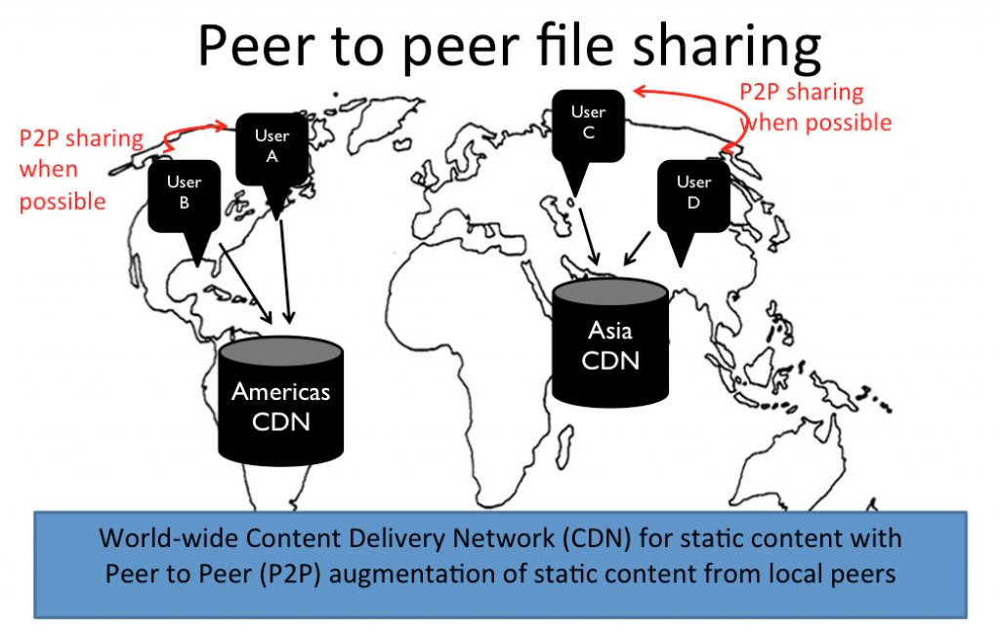

# WebRTC数据通道的5个用处 [(原文出处)](https://webrtc.org.cn/uses-of-datachannel/)

数据通道在WebRTC生态系统中通常扮演着二等公民的角色。WebRTC越来越受的关注是因为它能够非常简单地通过JavaScript来控制用户电脑的摄像头和麦克风。

WebRTC P2P架构中的音视频联合给了很多涉及安全的视频聊天应用很大的发展机会。远程医疗应用，浏览器上视频会议，协同工具，远程交互解决方案等等，所有这些有趣的应用都是基于WebRTC视频聊天工能。

像我们这些花费大量的时间在搭建WebRTC应用的人来说，当然很享受这些音视频的创新方面，但是我也和看重与数据通道有关的应用软件。数据通道通常也是作为次要特征来使用的。

## WebRTC 数据通道最常使用的功能

#1 文字聊天

你已经在安全的，加密的P2P视频聊天中使用了WebRTC，那为什么不在这些视频聊天应用中的文字聊天功能中也使用它呢？

#2 文件传输

通过把你的文件分解成小的比特流，你可以通过数据通道传输并且在接收端重组文件。举个例子，在远程医疗应用软件中可以安全的传输医疗文件。

## 其他的功能
#3 游戏

一个很经常的例子是在大型多用户在线游戏中使用数据通道处理本地数据。数据通道可以在确定的本地只包括玩家的RTC对等端连接中所使用。数据通道只交换所感兴趣的信息，比如说你正在注视的方向或者正在使用武器进行瞄准。把这些数据保留在数据通道中可以减少中心游戏服务器的负荷，以及减少本地玩家之间的延时。

#4 IoT/流数据

或许你想要在dashboard上共享数据流或者实时数据。这部分的数据可以作为正在进行的视频聊天的补充，或者其可以是完全独立于WebRTC音视频通道而单独使用。数据通道可以很好的解决这点，尤其是当你比希望通过中间服务器而直接在对等端传递时。比如，有一个“云计算”的变体叫做“雾计算”。在雾计算的概念中，想象你有很多的IoT设备并且需要与其他设备进行数据分享，但是数据从没有被发送给中间服务器。这些设备组成了没有中心点的计算机雾，并且可以通过WebRTC数据通道彼此进行交流。

#5 数据通道和内容传输网络

还有一个数据通道的用处在2016年5月12日与Dennis Martensson的交流中提到。Greta是一个使用WebRTC数据通道来在地理上相接近的网页浏览者之间共享数据的内容传输网络。内容传输网络允许在你这一端的静态资源从其他服务器中被读取，减少你网页端的负荷。除了传统的CDN以外，WebRTC数据通道允许你直接在浏览者和网页之间进行端对端的文件传输。

<!--  -->
WebRTC_CDN