## WebRTC数据通道的5个用处 [(原文出处)](https://webrtc.org.cn/uses-of-datachannel/)

数据通道在WebRTC生态系统中通常扮演着二等公民的角色。WebRTC越来越受的关注是因为它能够非常简单地通过JavaScript来控制用户电脑的摄像头和麦克风。

WebRTC P2P架构中的音视频联合给了很多涉及安全的视频聊天应用很大的发展机会。远程医疗应用，浏览器上视频会议，协同工具，远程交互解决方案等等，所有这些有趣的应用都是基于WebRTC视频聊天工能。

像我们这些花费大量的时间在搭建WebRTC应用的人来说，当然很享受这些音视频的创新方面，但是我也和看重与数据通道有关的应用软件。数据通道通常也是作为次要特征来使用的。

### WebRTC 数据通道最常使用的功能

#1 文字聊天

你已经在安全的，加密的P2P视频聊天中使用了WebRTC，那为什么不在这些视频聊天应用中的文字聊天功能中也使用它呢？

#2 文件传输

通过把你的文件分解成小的比特流，你可以通过数据通道传输并且在接收端重组文件。举个例子，在远程医疗应用软件中可以安全的传输医疗文件。

### 其他的功能
#3 游戏

一个很经常的例子是在大型多用户在线游戏中使用数据通道处理本地数据。数据通道可以在确定的本地只包括玩家的RTC对等端连接中所使用。数据通道只交换所感兴趣的信息，比如说你正在注视的方向或者正在使用武器进行瞄准。把这些数据保留在数据通道中可以减少中心游戏服务器的负荷，以及减少本地玩家之间的延时。

#4 IoT/流数据

或许你想要在dashboard上共享数据流或者实时数据。这部分的数据可以作为正在进行的视频聊天的补充，或者其可以是完全独立于WebRTC音视频通道而单独使用。数据通道可以很好的解决这点，尤其是当你比希望通过中间服务器而直接在对等端传递时。比如，有一个“云计算”的变体叫做“雾计算”。在雾计算的概念中，想象你有很多的IoT设备并且需要与其他设备进行数据分享，但是数据从没有被发送给中间服务器。这些设备组成了没有中心点的计算机雾，并且可以通过WebRTC数据通道彼此进行交流。

#5 数据通道和内容传输网络

还有一个数据通道的用处在2016年5月12日与Dennis Martensson的交流中提到。Greta是一个使用WebRTC数据通道来在地理上相接近的网页浏览者之间共享数据的内容传输网络。内容传输网络允许在你这一端的静态资源从其他服务器中被读取，减少你网页端的负荷。除了传统的CDN以外，WebRTC数据通道允许你直接在浏览者和网页之间进行端对端的文件传输。

<!--  -->

## WebRTC带宽估计[(原文出处)](https://webrtc.org.cn/bandwidth-estimation/)
带宽估计可能是WebRTC视频引擎中最重要的一部分了。带宽估计（BWE）模块的任务是决定你可以发送多大的视频流且不会造成网络拥塞，以此来保证不会降低视频质量。

在以前的带宽估计算法还是十分基础的，大体上是基于丢包而设计的。通常我们在开始慢慢的增加视频的比特率，直到我们检测到丢包为止。为了检测丢包，你使用标准的RTCP反馈，其中接收端使用RTCP接收端报告（RR）信息来周期性的报告丢包。

现在的带宽估计算法变得更加先进，尝试在拥塞严重到了路由器开始丢弃数据包之前就检测出来。这些算法通过分析数据包之间的延时来预测拥塞情况。想法是当你开始遇到拥塞时，数据会开始流入路由器中的缓冲区，延时也会变得更多样。这些算法中比较出名的几种是Google Congestion Control（就是WebRTC中用的），SCReAM以及SPROUT。如果你想要了解更多有关拥塞控制标准的历史发展和现状，你可以看一下Randell Jesup写的这篇很有趣的博文。

从WebRTC的最初级阶段开始，媒体引擎（由Google搭建，但是Firefox和Chrome都在使用）就是基于远端带宽估计理论而搭建的。正像我之前说的那样，接收端会分析包间延时，并且会对可用带宽产生一个估计值，然后使用RTCP信息报回给发送端，其中RTCP信息使用了一种被设计来完成这项工作的信息类型：REMB。另一个关于WebRTC实现的细节是，发送端不会只使用这个在REMB包中接收的带宽估计值，也会使用反馈的丢包来决定最终发送的目标视频比特率。

bwe1

这个实现的好处是它可以在检测到使用过度的时候迅速的降低比特率，即使此刻还没有探测到拥塞的时候。

但是在最近版本的Chrome中这点发生了改变，现在带宽估计的所有的逻辑都是发生在发送端。拥塞的基本检测跟以前没有什么大的差别，且发送端需要从接收端传来的延时信息来估计可用的带宽。这是用两个全新的机制/协议来完成的：

#1 传输宽序列号的报头扩展：所有视频RTP数据包都在报头处有额外的4位来包含一个序列号。这是通过下面语句与SDP协商得来：

bwe2

注意：这种新的序列号的思想是可以对音频和视频只使用一个计数器，但是Chrome还没有将其在音频领域中使用，所以我认为它现在还并不是很有用。

#2 传输反馈：接收端会周期性地将包含有关已接收数据包和包间延时的信息反馈给发送端。为了完成这项工作，接收端使用了新的RTCP包（传输反馈）。这是通过下面这条包括了新RTCP反馈信息的语句在SDP中协商得来：

bwe3

当你在观察这些传输反馈数据包是什么样子的时候，有意思的是你会意识到其中有Google建议的规范，以及官方标准化方案，但是真正使用的是在源码之中的实际实现。

这个RTCP反馈默认100ms发送一次，但是实际上是动态适应的，只会使用5%的可用带宽（最小值是50ms，最大值是250ms）。

为了将大小控制在最小，这种新的RTCP包的格式十分简洁，包括块内的分组包，以base+diff的形式存储数字，或者将粒度降低到0.25ms为间隔。我做了一个简单的测试，有了这些改进方案，其依旧会使用16Kbps来每50ms发送一次反馈数据包。

bwe4

你可以在remote_estimator_proxy.h以及transport_feedback.cc中查看相关实现。

 

发送端带宽估计的好处是什么？Google给出的解释是，这样做的话，所有的决定逻辑都会在一个地方（发送端），而且这会让测试新算法变得更简单，因为你不需要同时取决于两个端点。说实话，由于浏览器的自动更新，我看不出来这点改变可以带来什么大的好处，但是其确实更加的整洁，即便会在带宽使用方面更贵一点。另一项好处是，发送端可以知道自己所发送的数据流是什么类型的，也可以在发送普通视频，而不是做例如屏幕广播这种事情的时候使用不同的算法。

我们会受到实际影响吗？如果你搭建了一个需要进行带宽估计的媒体服务器，在某种程度上你需要更新你的实现。好消息是Chrome还会支持旧机制（REMB）一段时间，至少会持续到Firefox支持它之后。但是REMB可能不会再有新的进展了，而且现在出现bug的可能性会更高，所以我认为推迟更新太久并不是一个好主意。

发送端带宽估计真的就更好吗？我做了一个快速的测试（这是测试页面，你可以尝试一种，或者通过改变布尔值来进行别的测试），其中在Chrome中同时用了两种算法（老的REMB和新的传输反馈），其中新算法的表现要好的多，至少在连接开始阶段的上升部分要好的多。我不认为对于这种结果，除了Google现在全新投入在新算法中，而不管老算法，且所有的赶紧都只会发生在新算法中，这个原因以外还存在着什么技术上的解释。很显然在新算法中，头两秒内肯定是有什么特殊的方法来处理带宽估计，但是我也没有太深入的研究。

bwe5

现在什么人在做这件事情，以及现况是什么？发送端带宽估计是Chrome55版本中默认使用的算法，但是其还在开发过程中，所以我们应该做好还有很多改变的预期。官方的标准化工作在RMCAT工作组 IETF中进行，但是现在Chrome中大多数的可用实现都是Google自己的版本，都是Google自己的在建算法和反馈协议的规范。

 
*Chrome打算也在决定发送的音频比特率上使用带宽估计算法（计划在58版本中加入）

## WebRTC在低延迟媒体流之中的地位[(原文出处)](https://webrtc.org.cn/low-latency-media-streaming/)
Adobe最近给Flash写了一篇讣告，宣布Flash将在2020年退出历史舞台。我们已经知道了Flash大限将至，所以应该好好地来选一选它的替代品了。

使用Flash的一大好处就是它依赖RTMP协议所提供的媒体推流功能。现在很多浏览器已经让Flash的使用变得很困难了，所以很多内容供应商以及流服务都已经开始放弃Flash和RTMP转而寻找其他选择了。

有什么其他选择？

Flash的替代品有HLS和MPEG-DASH，这两个的工作方式比较相似。主要功能是给设备和浏览器发送媒体数据，在它们所适用的场景中相比延迟更加看重传输质量。

HLS和MPEG-DASH使用的是封包传输模型（packetized delivery model），这种模型基于一个清单将视频块切割并重组—如果有视频块在传输过程中丢失的话，为了保证数据的质量就需要对丢失块进行重传。所以，这两种的实现需要进行适当的缓存，在所有数据都可用之前要保持等待，然后再播放给用户。一句话来概括就是，传播失去了实时性。

一种解决办法是尝试改进HLS和MPEG-DASH实现，将他们优化到更低的延迟水平。或者选用Flash的第三种替代品，也就是我们今天的主角—WebRTC。

WebRTC：更高需求，更低延迟

媒体流和实时视频通话的主要区别是强度：实时视频通话在两端需要提供更好的“及时”性。用户们需要与对方进行互动，并且一直需要知道对方的状态。这就意味着他们需要在任何可能的状况中都保持状态，也就需要消耗很高的计算资源。

媒体流，不需要这种紧密的连接。我们同一时间会发生两种独立的会话：广播者和媒体服务器，以及媒体服务器和他的观众—每个都有他们自己的一套规则，性能，优化以及需求。

当你用一个实时视频通话技术来进行一个媒体流场景时，通常都会遇到范围问题—让大范围传输受到限制。

原因是运行WebRTC需要额外的资源。这也符合常理，因为传输的延迟越低，我们所需要花费的资源和能量也就越多。

lowlatency2

尽管使用WebRTC的代价要比使用HLS高，但是使用WebRTC还以为着你可以达到任何低延迟的要求。

WebRTC进行流媒体传输的未来

WebRTC已经面世6年了。绝大多数时间，它都被用来做视频通话。大家试着使用WebRTC进行直播流也只是2到3年前的事情，解决方案大多都是针对广播者的。

举个例子，很多网络会议平台选用WebRTC，最终都只是在广播端才使用，将观众端留给延迟更高的技术。这些解决方案使用的是广泛应用于视频通话的开源以及盈利的技术。

随着Flash慢慢淡出市场，新的，更有交互性的直播流服务正在崛起，我们看到有新的服务提供商以及实现方案在更适合推流的领域使用WebRTC。

这些解决方案都会减少设备之间隐私的需要，低于视频通话的状态，为了提高范围并且降低成本。他们不再谈论SFU和同播，而是将精力聚焦于像ABR（Adaptive Bitrate，自适应码率）这种缩写词。

WebRTC一定会在实时流媒体技术中排在前几位。让我们对这项新兴技术的未来拭目以待。

##  WebRTC应用可能出现的网络错误[(原文出处)](https://webrtc.org.cn/network-problems/)
为什么一个视频通话在某个环境下可以进行的很流畅，但是换了个网络环境就会变得很差？为什么一个音频通话一直在正常运行，却突然一下终端了呢？

network-problems1

有些是时候造成这些问题的原因是程序中存在bug。特别是安卓，简直臭名昭著，经常出现程序在一个设备上可以完美运行，但是换到另一个设备就崩溃的情况。

与iOS不同，iOS是的软件和硬件都是依据严格的标准，由同一家厂商一并设计而出的；而对于安卓来说，有很多不同的硬件和软件级别，由多个厂家设计，所以有的时候会导致没有预料到的奇怪错误出现。这个问题严重影响了应用软件适用于哪些只能手机，以及软硬件的适用范围。

而有些情况，这些问题是由较差的网络环境造成的，也就是可能有一个或者多个参数超过了我们设定的“好”的范围。如果你遇到了有的设备运行软件正常，有的设备运行出问题这种状况，那么你需要检查一下这几个参数：

1. 带宽

1. 延时

1. 丢包

1. 抖动

 

带宽

带宽是指数据可以在两个端点之间传输的速率。

你可以将你和远端之间的网络看成一个管道，而带宽就是这个管道最小的尺寸。你的网速可以特别的快，但是如果对方连入的是一个WiFi热点或者企业VPN，只有几KB/s的速度的话，你的网速再快也没有用。

如果一个不受控制的发送端所发送数据的速率超过了接收端的可用带宽，那么它就会迅速压垮整个网络，导致数据流质量产生严重的恶化。一个过载的连接会出现以下几种问题：

1. 永久的视频停止

1. 永久的视频帧速率降低

1. 断断续续的音频

1. 连接性能下降

如果你遇到了这几个问题，可以用fast.com或者speedtest.net这两个网址来测试带宽大小。

在你的应用中，你可以简单的从服务器下载一个大的文件，然后观察一两秒之内能下载多少，来快快的进行一个带宽测试。虽然做法很简单，但是是十分有效的。

因为连接是活跃的，所以最好的解决方法是，发送方通过使用RTCP回馈来尽可能准确的估计接收方的可用带宽。IceLink将RTCP数据作为它API的一部分展示出来，使应用可以实时的调整媒体流以适应他们的需求。

 

延时

延时值得是数据从一个网络端口传输到另一个端口所花费的时间（通常以毫秒为单位）。

往返时延（RTT）与延时密切相关，因为它是数据从一个网络端口传输到另一端再传回来的时间。如果x是A到B的延时，y是B到A的延时，那么RTT就是x+y。

视频通话的主要延时是听见音频和看见视频方面上的延迟。一个小的延时（不超过100ms）并不会在双端通话之间被察觉到。如果数据流是一个单向的音频广播，那么甚至较为严重的延时也不会造成多大的问题。

而视频完全就是另一种情况了。

一个高效的视频流很大程度上依赖于，出现丢包的时候接收端发回给发送端的被动应答（NACK）。发送端有机会重发丢失的数据包，避免重发一个完整的帧刷新。

一个高延时的网络会极大的降低网络的效率，因为RTT可能会远远的超过接收端可等待的时间范围。为了确保食品的音画同步性，接收端只能最多等待音频缓冲区那么长的时间。音频通常不会被这种情况影响，因为音频并不依赖于关键帧。

一个高延时的连接可能造成：

1. 音视频的延时

1. 短暂的视频停顿

1. 短暂的视频帧速率下降

1. 平滑的音频

 

丢包

丢包是指，在一段时间内数据包在数据流中被丢弃或者丢失的数量或者百分比。

大多数的媒体流都会或多或少地丢弃一些数据包，尤其是在WiFi网络的环境下。在一个实时媒体流中，宁愿让连接的设备主动丢弃掉一些数据/帧，也不愿意产生延时。

如何处理丢包是由发送数据本身决定的。如果前向纠错（FEC）被启用，那么有时就可以通过已接收到的数据来自动恢复丢失的数据。

如果FEC不可用的话，那么智能的音频编码器（比如Opus）可以利用播放的波形来产生一个接近丢失音频包的近似波形—这项技术被称为丢帧隐藏（PLC）。

在音频编码器不支持PLC技术，或者丢包率实在太高的情况下，会产生空的数据包来填补丢失的空洞。这就会导致音频的中断，但是会让播放缓冲随时准备好接收接下来传递的数据。

尽管音频包可以通过NACK和重传机制来修复，但是通常来讲在实时媒体通信中不推荐这么做，因为：

#1 接收到被修复的数据包的时候已经太晚了，而无法使用（时间不等人）

#2 因为音频已经处于一个很低的比特率的状态，NACK请求会很大比例地增加音频所占带宽

#3 除非丢包率很高（这种情况下NACK可能也无法起到作用），音频的中断不会长到对会话产生影响

#4 与视频不一样，对数据包的恢复是立刻产生的，不需要关键帧。

视频丢包通常情况下使用前文所提到的NACK进行处理，因为要进行一个全帧刷新的网络消耗是在是太大了。

如果NACK失败了的话，我们就没有其他的选择了，只能发送一个PLI来进行请求。

通常，在良好的网络情况下，适当的丢包并不会被觉察到。如果丢包率较高的话就会引起一下问题：

1. 经常的视频暂停

1. 经常的视频帧速率下降

1. 断断续续的音频

如果你查看你的IceLink日志，通常会看到发出了很多课NACK，有可能还会有一些涂销丢失标识（PLI），以及很多产生的PLC。

如果丢包率很高而且恢复机制无法弥补的话，视频就会卡住，帧速率会下降，声音会因为经常断续而变得难以辨识。如果与高延迟网络相结合，丢包就会造成最严重的影响，会影响到基于NACK的重传机制的效率。

如果本质原因是过载的网络设备，那么解决方法就是降低比特率，这会降低对网络的需求。

当WiFi网络十分拥挤或者与邻近网络产生干扰的时候，丢包这类问题会经常出现。

 

抖动

抖动是一项用来描述网络流中时间稳定性的参数。换句话说，数据包实际到达的时间与应该到达的时间之间的间隔是多大。

因为UDP并不能保证传输的有序性，抖动会发生在每个连接中。每次网络路径上的传递都可能会发生抖动，所以高延时网络或者跳跃次数多的网络更有可能出现高抖动值的问题。

因为媒体解码器/播放模块必须按顺序处理数据包，所以如果在收到数据包之后立即就进行处理的话就会出现问题。

一旦一个数据包被解码器进行处理时，任何“之前的”数据包就必须被丢弃掉。这很容易造成丢掉可以增加音频质量或者进行重传视频的重要数据。

要想消除抖动的影响就需要媒体接收端通过一个“抖动缓冲区”（jitter buffer）来处理数据。

抖动缓冲区的作用是对蒸菜接收处理的媒体数据包进行适当的延迟，以达到可以平滑输出的目的，并且确保数据包处在一个正确的顺序中。更大的延迟值会更好的消除网络抖动，但会给传输带来更大的延时。因为每次通话的网络状态可能差别很大，所以不同情况下的最佳抖动缓冲区也就不一样：需要根据需要来增加或者减少延迟。

假设抖动缓冲区可以快速的适应网络状态的改变，高的抖动值会造成：

1. 突发的视频卡住

1. 突发的视频帧速率下降

1. 突发的音频断续

这些问题与丢包造成的问题很相似，但是可以通过抖动缓冲区来解决。查看你的IceLink日志，你应该可以看到抖动缓冲区大小的增加/减少来适应不同的网络需求。

## SDP：被释放出的恐惧（一） [(原文出处)](https://webrtc.org.cn/sdp-1/)
我们在webrtcHacks中已经更新了很多关于会话描述协议的文章（例如《如何通过修改SDP来限制WebRTC带宽》）。为什么？因为它往往是WebRTC中最容易困惑但又很关键的一方面。也是最有争议的。之前WebRTC对SDP讨论导致了与之并行的ORTC标准开发，而这个标准现在已经大致上回归到了核心规范中。但是，现实情况是非基于SDP的WebRTC仍然是开发的小部分，很多人怀疑即使已经得到了官方接受，这种情况也很难会改变。

为了更新SDP的示例，之前的客座作家Iñaki Baz Castillo重新加入了我们。虽然有多年参与到WebRTC标准化和部署工作的经验，但是SDP还是在他从零起步开始搭建mediasoup的SFU时给他带来了新的痛苦。Iñaki提供了SDP到底是干什么的背景知识，ORTC的不同之处，以及SDP在一些越来越多的常见用例中出现的实际问题，你们很多人会发现这个很有用。

sdp1

写这篇文章的灵感来源于我发给MMUSIC WG的一篇电子邮件，在其中我抱怨了SDP的使用问题，我将它比喻成“用于交换多媒体信息的最小不可去除单位”。

我想是时候把SDP从我们的生活中剔除出去了，特别是在WebRTC中，这样开发者就可以更好的进行媒体信令。

在我开始详细介绍SDP带来的新问题之前，让我们先来回顾一下SDP在WebRTC中的任务以及ORTC—使用WebRTC中使用SDP的主要替代方案。

WebRTC 1.0中SDP的简要介绍

尽管WebRTC 1.0公开了一个API来处理和传送本地音频，视频和/或数据给远端WebRTC对等端，但是信息交换单元还是SDP。这基本上意味着不管本地执行的什么操作，SDP都必须发送给另一方（或者让对方生成一个可以代表我们本地操作的SDP）并且通过setRemoteDescription()“提供”给RTCPeerConnection。webrtcHacks在这里有一个一行一行解释SDP的教程，除了标准以外是一个很好的参考。

SDP是干什么用的

WebRTC的SDP传递有关所有通讯层的信息，包括：

1. 用来在多媒体会话中建立两个对等端之间网络通道的ICE参数以及可选ICE候选

1. DTLS参数，用于执行DTLS握手以及交换用于音频和视频的SRTP密钥，以及/或者在DataChannel消息将要交换处建立加密的传输

1. 决定哪个对等端进行发送和接收的RTP参数

参数及m=行

SDP提供包括必须被远端对等端接收或者拒绝的m=段。每个m=段包括以下这些信息：

1. 发送的媒体种类：audio, video或者application。

1. 这种媒体部分的目的是发送媒体，接收媒体还是二者都有。

1. RTP参数。

1. ICE和DTLS传输参数。

SDP还包括允许使用BUNDLE的全局参数。BUNDLE的目的是将不同的m=段归于“传送”组，因此不是每个媒体部分都建立一个单独的ICE路径和DTLS连接，而是他们都使用一个ICE路径和DTLS连接。

尽管SDP中单独一个媒体段的意义和作用可能会容易混淆。WebRTC 1.0采用了一种方法将每个m=段携带关于发送的单独MediaStreamTrack信息，接收的MediaStreamTrack或者二者都有。

假设两个对等端之间的双向音频和/或视频，媒体段的RTP参数决定了发送和接收的编解码器。这样的协商使SDP请求方使用编解码器A发送媒体，同时SDP应答方使用编解码器B发送媒体。这是SIP/VoIP实现中典型问题和不兼容问题的原因，同样也使用与目前WebRTC端点。

WebRTC 1.0 SDP的总结

WebRTC 1.0 API提供一些实体：

1. RTCPeerConnection：基本可以代表一切（发送以及接收轨道或者数据，本地以及远端SDP表示等等）

1. RTCTransceiver：引用了SDP中一个m=段

1. RTCRTPSender：收发器的发送部分。

1. RTCRTPReceiver：收发器的接收部分。

出于这篇文章想表达的目的，让我们专注于下面这些SDP的总结：

1. 一个m=段包含用于建立传输的ICE和DTLS传输参数

1. 在浏览器端的时候，m=audio或者m=video部分传输用于发送和/或接收MediaStreamTrack的RTP参数

1. WebRTC 1.0 API提供的类/实体与SDP的分析和语意密切相关。

## SDP：被释放出的恐惧（二） [(原文出处)](https://webrtc.org.cn/sdp-2/)

ORTC简单概述

在长时间从事ORTC之后我才能说这是合适的做法。这离完美差的还很远，尤其是当它处理发送/接收RTP参数的时候。但是，与SDP机制不同，它准确的将不同通信层分成单独的模型和类，使它变得更加开发者友好，更容易理解，而且提供更令人舒服的API。

ORTC建议使用基于代表不同通信层的类的完全不同的API。所以，在ORTC中我们有像RTCIceGatherer，RTCIceTransport，以及RTCDTLSTransport这类的实体。还有与WebRTC相同的实体，比如RTCRtpSender以及RTCRtpReceiver（但是不包括RTCTransceiver）。

没有SDP

ICE，DTLS以及RTP参数必须由对等端进行交换以建立多媒体会话。然而API没有规定使用特定的规范格式（比如SDP）。使用什么格式以及协商过程完全由开发人员决定。

结构

ORTC的层包括：

1. ICE：通过提供一个RTCIceGatherer类（用来检索我们的ICE候选项）以及一个RTCIceTransport类（用来建立与远端对等端/服务器的一个网络路径），我们可以通过任何方式自由地将ICE相关参数发送给远端对等端。

1. DTLS：RTCDtlsTransport类负责通过RTCIceTransport提供的网络路径建立一条安全的媒体/数据通道。还是一样，这些都是由开发人员来决定如何发送本地DTLS参数给远端。

1. 媒体：在我们有了一条安全的路径（ICE + DTLS）之后，我们可以创建RTCRtpSender和RTCRTPReceiver实例来发送媒体给远端，以及从远端接收媒体，或者创建一个RTCDataChannel实例来发送/接收数据。是的，与这些类相关联的参数可以通过共享JSON对象来传输到远端。

要说清楚的是，我们是如何将我们的RTC参数发送给远端对等端并不那么重要。ORTC API给远端提供提取这些参数的功能，以及创建一个合适的ORTC API调用它们。

sdp21

ORTC设计的优点很明确：没有过多的重协商！当RTP媒体发生变化时，RTCRtpSender和RTCRTPReceiver不需要重新协商ICE和/或DTLS参数。而是只有新的RTP参数才必须传送给远端（或者从远端接收）。

那么，WebRTC 1.0中的SDP又怎么样呢？

在WebRTC 1.0中我们不将RTC参数发送给远端，而是发送一个完整的SDP BLOB。一个SDP包括关于ICE，DTLS，RTP等等所有的信息。基本上，对等端A产生一个SDP请求，包括了有关其本地ICE参数，DTLS参数，发送媒体的信息，并且想要接收媒体。这个SDP请求被发送给远端对等端，该远端对等端将其作为远端描述应用于RTCPeerConnection。

添加新的流

对于未来添加媒体流（比如添加网络摄像头视频），对等端产生另一个完整的SDP请求，并且将其传送给远端，还是，该远端将其作为远端描述应用。但这不是完全正确的。理论上说，并没有真正再次发送完整SDP的需求。事实上，发送方可以检查其新的本地SDP请求，然后仅把添加的内容通知给远端。不管怎样，远端向浏览器指示新接收媒体的唯一方法是拥有或者重建一个完整的SDP请求，并且调用setRemoteDescription()。

要明确的是：不管对等端是如何将RTP参数发送给另一方的，最终JavaScript和浏览器的WebRTC引擎之间的通信都是通过将完整的SDP块发送给RTCPeerConnection或者从RTCPeerConnection接收而实现的。这里并没有一个“真正的API”，也就是浏览器必须对新的远端SDP进行全面的“重新检查”，以找到发生了什么变化。包括：

1. 检查远端ICE参数是否发生变化

1. 检查远端DTLS是否发生变化

1. 检查是否添加了新的媒体轨道

1. 检查现有的正在进行的媒体轨道是否被改变或者停止

1. 检查正在进行的媒体轨道的参数是否被改变

用一个真实的例子解释为什么这很烦

可以很清楚的看到这其中有什么问题。如果看不出来的话，我会用一个关于SDP a=setup真实的用例来解释：

1. 让我们假设Alice想要与Bob进行音频和数据通道通信，所以Alice创建了她的本地RTCPeerConnection，并且得到了相应的SDP请求。

1. 根据RFC 5763，SDP请求的a=setup属性必须是“actpass”，也就是应答方（Bob）需要决定谁是DTLS用户谁是DTLS服务器。

1. Bob生成相应的SDP应答，其中包括a=setup:active，意思是Bob成为了DTLS用户，而Alice成为DTLS服务器。

1. 在ICE和DTLS处理之后，Alice和Bob两个人互相交换了他们的音频和数据。

1. 之后，Bob想要在通信中加上网络摄像头捕捉的视频，所以他得到了一个包括网络摄像头流信息的SDP重请求。

1. 还是，依据RFC 5673，这个SDP重请求中要有a=setup:actpass。

1. Alice接到SDP重请求并且产生一个重响应。

1. 为了保持现有的DTLS关联开放，这个SDP重响应必须有a=setup:passive项。

你注意到了吗？为了不改变传输，SDP重请求和重响应必须表示与在最初SDP交换中a=setup属性相不同的值。

这件事好像也不难是吧？好，事实上是：

1. “在收到SIP重邀请之后，FreeSwitch会破坏之前的DTLS关联，因为会在SDP响应中设置一个错误的DTLS角色。”（错误报告）这个问题在2017年4月24号修复。

1. “在发送重邀请的时候，Asterisk会根据规范设置一个无效的a=setup:active属性。”（错误报告）

1. “Firefox会在产生重响应的时候转换到DTLS主动状态。”（错误报告）

## SDP：被释放出的恐惧（三） [(原文出处)](https://webrtc.org.cn/sdp-2-2/)
SDP是用来通知的？

让我们重新思考一下：

在上述所有的场景中，我们都没有兴趣建立一个新的DTLS关联。而是发送一个完整的SDP给另一方来通知与RTP流相关的改变。没有别的。但是，WebRTC“API”规定的“完全重新检查”让SDP接收方重新检查关于ICE，DTLS，RTP等内容，从而导致了上述问题。

记住，在ORTC中根本没有可能出现这种可笑的错误。这是因为，在ORTC中，传送关于新发送RTP流的信息也不包括再次发送ICE+DTLS参数。

完全重新检查

在上文中我们已经讨论过这点，但是为了明确，这是WebRTC终端在使用SDP重请求和重应答调用setRemoteDescription()的所有任务：

1. 检查a=ice-ufrag和/或a=ice-pwd被改变。如果改了，重启ICE。

2. 检查a=fingerprint是否被改，或者应答中a=setup属性是否具有可以破坏之前协商的DTLS角色的值。如果有，就建立一个新的DTLS关联。

3. 检查先前存在的媒体副本中的方向属性是否变成a=inactive或者a=recvonly，或者它的媒体端口是不是0。如果是这样，就假设这个媒体流已经被停了。

4. 检查是否添加了新的m=audio/video/data部分。

5. 检查SSRC，编解码器，负载值，RTP报头扩展映射，每个编解码器的RTCP可用反馈等等是否改变。如果改了的话，准备好接收修改的数据流。

这对于WebRTC实现以及在ORTC上搭建RTCPeerConnection shim或者其他媒体引擎的开发人员来说，是非常有问题的。

切勿禁用音频！

让我们假设我们有一个双向且BUNDLE的音频+视频会话，第一个m=部分对应于音频交换。

我们继续假设我们想要关闭/删除我们的麦克风。通常我们会得到相应的RTCRtpSender并且调用stop()。一个新的createOffer()调用会产生一个包括a=recvonly的m=audio部分。

幸运的是，收发器（或者媒体部分）因为我们正在接收远端的音频，所以还是处于活跃状态。现在让我们假设远端对等端也关闭/删除音频输入。在SDP请求/响应重协商之后，m=audio部分会包括a=inactive，意味着目前没有音频正在发送或者接收。

Firefox关于a=inactive的表现

那么Firefox的反应如何呢？当音频被完全移除之后，Firefox会设置端口0，以及在m=audio段中设置a=inactive。它还将其中所有的ICE和DTLS参数，并且将音频标签从BUNDLE组中移出。结果呢？ICE+DTLS被关闭，不管它是不是还被用来承载视频。

这里有一些从Firefox浏览器中提取出的真实的SDP来说明这个问题：

1. Firefox产生一个启用音频（麦克风）和视频（网络摄像头）的SDP请求。RTCPeerConnection中有bundlePolicy: ‘max-bundle’，所以它只是将ICE内容设置到第一个媒体部分中（m=audio段）：
~~~ js
v=0

o=mozilla…THIS_IS_SDPARTA-57.0a1 5362413390007385508 1 IN IP4 0.0.0.0

s=-

t=0 0

a=sendrecv

a=fingerprint:sha-256 CC:11:0E:0D:B2:7D:FC:F9:11:2F:68:74:11:B3:7E:13:C0:C3:05:78:F3:29:10:C6:E9:14:8A:0A:AB:A4:08:6A

a=group:BUNDLE sdparta_0 sdparta_1

a=ice-options:trickle

a=msid-semantic:WMS *

m=audio 58960 UDP/TLS/RTP/SAVPF 109 9 0 8 101

c=IN IP4 1.2.3.4

a=candidate:0 1 UDP 2122252543 192.168.1.34 58960 typ host

a=candidate:1 1 TCP 2105524479 192.168.1.34 9 typ host tcptype active

a=sendrecv

a=end-of-candidates

a=extmap:1/sendonly urn:ietf:params:rtp-hdrext:ssrc-audio-level

a=fmtp:109 maxplaybackrate=48000;stereo=1;useinbandfec=1

a=fmtp:101 0-15

a=ice-pwd:4650fd5710897bee3bf874465c372e87

a=ice-ufrag:62c997d1

a=mid:sdparta_0

a=msid:{ee311a2b-98e0-dc49-b7ab-5d5058ef8a08} {0aac500e-e6f0-1f4a-88e4-706d215e3bfe}

a=rtcp-mux

a=rtpmap:109 opus/48000/2

a=rtpmap:9 G722/8000/1

a=rtpmap:0 PCMU/8000

a=rtpmap:8 PCMA/8000

a=rtpmap:101 telephone-event/8000

a=setup:actpass

a=ssrc:858486657 cname:{18d5ea4e-9fdc-4844-90f6-10eabff59478}

m=video 0 UDP/TLS/RTP/SAVPF 120 121 126 97

c=IN IP4 1.2.3.4

a=bundle-only

a=sendrecv

a=extmap:1 http://www.webrtc.org/experiments/rtp-hdrext/abs-send-time

a=extmap:2 urn:ietf:params:rtp-hdrext:toffset

a=fmtp:126 profile-level-id=42e01f;level-asymmetry-allowed=1;packetization-mode=1

a=fmtp:97 profile-level-id=42e01f;level-asymmetry-allowed=1

a=fmtp:120 max-fs=12288;max-fr=60

a=fmtp:121 max-fs=12288;max-fr=60

a=ice-pwd:4650fd5710897bee3bf874465c372e87

a=ice-ufrag:62c997d1

a=mid:sdparta_1

a=msid:{ee311a2b-98e0-dc49-b7ab-5d5058ef8a08} {8ba95436-369f-5b48-abe8-7c316b2b706d}

a=rtcp-fb:120 nack

a=rtcp-fb:120 nack pli

a=rtcp-fb:120 ccm fir

a=rtcp-fb:120 goog-remb

a=rtcp-fb:121 nack

a=rtcp-fb:121 nack pli

a=rtcp-fb:121 ccm fir

a=rtcp-fb:121 goog-remb

a=rtcp-fb:126 nack

a=rtcp-fb:126 nack pli

a=rtcp-fb:126 ccm fir

a=rtcp-fb:126 goog-remb

a=rtcp-fb:97 nack

a=rtcp-fb:97 nack pli

a=rtcp-fb:97 ccm fir

a=rtcp-fb:97 goog-remb

a=rtcp-mux

a=rtpmap:120 VP8/90000

a=rtpmap:121 VP9/90000

a=rtpmap:126 H264/90000

a=rtpmap:97 H264/90000

a=setup:actpass

a=ssrc:2390117206 cname:{18d5ea4e-9fdc-4844-90f6-10eabff59478}

 ~~~ 

1. 远端提供不包括任何音频或者视频流的SDP应答（所以Firefox会发送音频和视频，但是不会从远端接收任何数据）：
~~~ js
v=0

o=REMOTE 30596888 2 IN IP4 0.0.0.0

s=-

t=0 0

a=sendrecv

a=fingerprint:sha-512 E0:71:C6:F8:CD:DA:01:05:9A:9F:B7:E9:BD:BF:DA:5F:80:56:13:F4:48:F1:56:AC:2C:72:E1:54:8C:7C:9A:0C:2B:A1:B3:B3:A2:38:E7:83:87:D8:38:2B:4E:F0:CB:FD:FD:55:77:64:CF:26:45:FC:2C:59:A4:93:B8:3B:64:3B

a=group:BUNDLE sdparta_0 sdparta_1

a=ice-lite

a=msid-semantic:WMS *

m=audio 7 RTP/SAVPF 109

c=IN IP4 127.0.0.1

a=candidate:udpcandidate 1 udp 1082702079 99.99.99.99 42936 typ host

a=recvonly

a=end-of-candidates

a=extmap:1 urn:ietf:params:rtp-hdrext:ssrc-audio-level

a=fmtp:109 maxplaybackrate=0;stereo=0;useinbandfec=1

a=ice-options:renomination

a=ice-pwd:5rc2025mfkzff6cze0xj5ra34pogs7to

a=ice-ufrag:wardj9g9mvmeixf6

a=mid:sdparta_0

a=rtcp-mux

a=rtpmap:109 opus/48000/2

a=setup:active

m=video 7 RTP/SAVPF 120

c=IN IP4 127.0.0.1

a=candidate:udpcandidate 1 udp 1082702079 99.99.99.99 42936 typ host

a=recvonly

a=end-of-candidates

a=extmap:2 urn:ietf:params:rtp-hdrext:toffset

a=extmap:1 http://www.webrtc.org/experiments/rtp-hdrext/abs-send-time

a=ice-options:renomination

a=ice-pwd:5rc2025mfkzff6cze0xj5ra34pogs7to

a=ice-ufrag:wardj9g9mvmeixf6

a=mid:sdparta_1

a=rtcp-fb:120 nack

a=rtcp-fb:120 nack pli

a=rtcp-fb:120 ccm fir

a=rtcp-fb:120 goog-remb

a=rtcp-mux

a=rtpmap:120 VP8/90000

a=setup:active

 ~~~ 

1. 之后，在Firefox中运行的应用决定关闭麦克分并且停止发送数据。基本上它是通过调用pc.removeTrack(micRtpSender)并且这是新的本地SDP的样子：
~~~ js
v=0

o=mozilla…THIS_IS_SDPARTA-57.0a1 5362413390007385508 2 IN IP4 0.0.0.0

s=-

t=0 0

a=sendrecv

a=fingerprint:sha-256 CC:11:0E:0D:B2:7D:FC:F9:11:2F:68:74:11:B3:7E:13:C0:C3:05:78:F3:29:10:C6:E9:14:8A:0A:AB:A4:08:6A

a=group:BUNDLE sdparta_1

a=ice-options:trickle

a=msid-semantic:WMS *

m=audio 58960 UDP/TLS/RTP/SAVPF 0

c=IN IP4 1.2.3.4

a=inactive

a=end-of-candidates

a=mid:sdparta_0

a=rtpmap:0 PCMU/8000

m=video 58960 UDP/TLS/RTP/SAVPF 120 121 126 97

c=IN IP4 1.2.3.4

a=sendrecv

a=extmap:1 http://www.webrtc.org/experiments/rtp-hdrext/abs-send-time

a=extmap:2 urn:ietf:params:rtp-hdrext:toffset

a=fmtp:126 profile-level-id=42e01f;level-asymmetry-allowed=1;packetization-mode=1

a=fmtp:97 profile-level-id=42e01f;level-asymmetry-allowed=1

a=fmtp:120 max-fs=12288;max-fr=60

a=fmtp:121 max-fs=12288;max-fr=60

a=ice-pwd:4650fd5710897bee3bf874465c372e87

a=ice-ufrag:62c997d1

a=mid:sdparta_1

a=msid:{ee311a2b-98e0-dc49-b7ab-5d5058ef8a08} {8ba95436-369f-5b48-abe8-7c316b2b706d}

a=rtcp-fb:120 nack

a=rtcp-fb:120 nack pli

a=rtcp-fb:120 ccm fir

a=rtcp-fb:120 goog-remb

a=rtcp-fb:121 nack

a=rtcp-fb:121 nack pli

a=rtcp-fb:121 ccm fir

a=rtcp-fb:121 goog-remb

a=rtcp-fb:126 nack

a=rtcp-fb:126 nack pli

a=rtcp-fb:126 ccm fir

a=rtcp-fb:126 goog-remb

a=rtcp-fb:97 nack

a=rtcp-fb:97 nack pli

a=rtcp-fb:97 ccm fir

a=rtcp-fb:97 goog-remb

a=rtcp-mux

a=rtpmap:120 VP8/90000

a=rtpmap:121 VP9/90000

a=rtpmap:126 H264/90000

a=rtpmap:97 H264/90000

a=setup:actpass

a=ssrc:2390117206 cname:{18d5ea4e-9fdc-4844-90f6-10eabff59478}

 ~~~

注意到了吗？在第一媒体段中再也没有包括a=candidate或者a=ice-ufrag/pwd的行了，意味着，通过遵守SDP规则，浏览器关闭了ICE+DTLS连接，所以不管视频是否正在发送，媒体传输已经停止了。

这不是Firefox中的一个bug，而是规范中的bug，因为它取决于SDP语意所以这个bug会出现。

只是因为我们想要移除音频轨道就关闭或者重启ICE+DTLS传输是毫无理由的。显然在ORTC中不会发生。但是，在WebRTC中，我们不能只是发送“音频轨道关闭”，但是，我们发送的是一个完整的SDP。这个SDO包括有关所有层和流的信息。更坏的是：每个媒体段都包括传输的信息。然后，如果我们移除了第一媒体段，BUNDLE会变的乱七八糟，而且根据浏览器，传输也会被关掉。

那么这个问题能修复吗？当然可以。越来越多针对SDP的修改可以避免这个问题。WebRTC生态系统中最聪明的人可以花费宝贵的时间来讨论出标准化这些修改的最佳方法。

当SDP处理简单的双向音频时是没问题的。但是现今，SDP是无法维持的。

真的吗？！

这简直无法理喻。我们不需要它。我们不需要这些由传统媒体描述格式（SDP）而产生的问题。我们只需要一个API来进行发送，以及一个API进行接收，就不需要额外的东西了。

## 比特率，带宽，速度：这都什么意思？ [(原文出处)](https://webrtc.org.cn/bitrate-bandwidth-speed/)
互联网有一套自己的词语（或者行话）。大多数的次人们都已经熟知：比如谷歌一下（搜索），巨魔（那家伙）等等。

但是有些词汇，特别是那些技术性质的专业术语的意思有的时候可以互换使用。最有代表性的就是网络速度，带宽和比特率了。

首先，让我们抛开速度这个词不看，这会让事情变的更加清楚一点。速度是一个很模糊的术语，它可以包含带宽和比特率的意思。

好了，现在没有字面上的困惑了，我们就可以继续探讨那些可以明确定义的：

比特率

在指定的时间量内（通常为1秒）可以从一点传送或处理到另一个点的比特数（都是0或者1）。基本上可以将其理解为高速公路的限速。

带宽

任何时候可以传输或处理的数据总量（通常也是1秒）。因此，带宽和比特率通常以千比特每秒或者兆比特每秒为单位。你可以把带宽想象成你的车可以容纳的人数。

他们之间的关系

我们用一个日常生活中的例子来类比说明比特率和带宽之间的关系。如果你有一个限搭载40人的客车以每小时60英里的速度行驶，那么你就可以在一个小时之内将40个人运送到60英里以外的地方。但是现在，让我们假设你在一辆双座的兰博基尼跑车上，每小时可以行驶251英里。如果开跑车，你可以更快的行驶出相同的距离，但是人数就会少很多（2个人在一小时内行驶251英里）。

比特率和带宽之间的关系也是如此。如果你有更多的带宽的话，你就可以传输更多的比特量。

总的来说

带宽是容量，而比特率是传输速率。

## Webrtc中的带宽自适应算法 [(原文出处)](https://webrtc.org.cn/webrtc_bandwidth_20180226/)
Webrtc 中的带宽自适应算法分为两种：

1. 发端带宽控制，　原理是由 RTCP 中的丢包统计来动态的增加或减少带宽，在减少带宽时使用TFRC 算法来增加平滑度。

2. 收端带宽估算，　原理是并由收到 RTP 数据，估出带宽；　用卡尔曼滤波，对每一帧的发送时间和接收时间进行分析，　从而得出网络带宽利用情况，修正估出的带宽。

两种算法相辅相成，　收端将估算的带宽发送给发端，　发端结合收到的带宽以及丢包率，调整发送的带宽。

下面具体分析两种算法：

1. 发送端带宽控制

2. 接收端带宽估算算法分析

结合文档http://tools.ietf.org/html/draft-alvestrand-rtcweb-congestion-02以及源码webrtc/modules/remote_bitrate_estimator/overuse_detector.cc进行分析。

带宽估算模型： d(i) = dL(i) / c + w(i)     d(i)两帧数据的网络传输时间差，dL(i)两帧数据的大小差， c为网络传输能力， w(i)是我们关注的重点， 它主要由三个因素决定：发送速率， 网络路由能力， 以及网络传输能力。w(i)符合高斯分布， 有如下结论：当w(i)增加是，占用过多带宽（over-using)；当w(i)减少时，占用较少带宽（under-using)；为0时，用到恰好的带宽。所以，只要我们能计算出w(i)，即能判断目前的网络使用情况，从而增加或减少发送的速率。

算法原理：即应用kalman-filters（卡尔曼滤波）

theta_hat(i) = [1/C_hat(i) m_hat(i)]^T   // i时间点的状态由C, m共同表示，theta_hat(i)即此时的估算值

z(i) = d(i) – h_bar(i)^T * theta_hat(i-1)  //d(i)为测试值，可以很容易计算出， 后面的可以认为是d(i-1)的估算值， 因此z(i)就是d(i)的偏差，即residual

theta_hat(i) = theta_hat(i-1) + z(i) * k_bar(i) //好了，这个就是我们要的结果，关键是k值的选取，下面两个公式即是取k值的，具体推导见后继博文

E(i-1) * h_bar(i)
k_bar(i) = ——————————————–
var_v_hat + h_bar(i)^T * E(i-1) * h_bar(i)
E(i) = (I – K_bar(i) * h_bar(i)^T) * E(i-1) + Q(i)   // h_bar(i)由帧的数据包大小算出

由此可见，我们只需要知道当前帧的长度，发送时间，接收时间以及前一帧的状态，就可以计算出网络使用情况。

接下来具体看一下代码：
~~~ c
 1 void OveruseDetector::UpdateKalman(int64_t t_delta,
 2                                   double ts_delta,
 3                                   uint32_t frame_size,
 4                                   uint32_t prev_frame_size) {
 5  const double min_frame_period = UpdateMinFramePeriod(ts_delta);
 6  const double drift = CurrentDrift();
 7  // Compensate for drift
 8  const double t_ts_delta = t_delta - ts_delta / drift;  //即d(i)
 9  double fs_delta = static_cast<double>(frame_size) - prev_frame_size; 
10  // Update the Kalman filter
11  const double scale_factor =  min_frame_period / (1000.0 / 30.0);
12  E_[0][0] += process_noise_[0] * scale_factor;
13  E_[1][1] += process_noise_[1] * scale_factor;
14  if ((hypothesis_ == kBwOverusing && offset_ < prev_offset_) ||
15      (hypothesis_ == kBwUnderusing && offset_ > prev_offset_)) {
16    E_[1][1] += 10 * process_noise_[1] * scale_factor;
17  }
18  const double h[2] = {fs_delta, 1.0}; //即h_bar
19  const double Eh[2] = {E_[0][0]*h[0] + E_[0][1]*h[1],
20                        E_[1][0]*h[0] + E_[1][1]*h[1]};
21  const double residual = t_ts_delta - slope_*h[0] - offset_; //即z(i)， slope为1／C
22  const bool stable_state =
23      (BWE_MIN(num_of_deltas_, 60) * fabsf(offset_) < threshold_);
24  // We try to filter out very late frames. For instance periodic key
25  // frames doesn't fit the Gaussian model well.
26  if (fabsf(residual) < 3 * sqrt(var_noise_)) {
27    UpdateNoiseEstimate(residual, min_frame_period, stable_state);
28  } else {
29    UpdateNoiseEstimate(3 * sqrt(var_noise_), min_frame_period, stable_state);
30  }
31  const double denom = var_noise_ + h[0]*Eh[0] + h[1]*Eh[1];
32  const double K[2] = {Eh[0] / denom,
33                       Eh[1] / denom}; //即k_bar
34  const double IKh[2][2] = {{1.0 - K[0]*h[0], -K[0]*h[1]},
35                            {-K[1]*h[0], 1.0 - K[1]*h[1]}};
36  const double e00 = E_[0][0];
37  const double e01 = E_[0][1];
38  // Update state
39  E_[0][0] = e00 * IKh[0][0] + E_[1][0] * IKh[0][1];
40  E_[0][1] = e01 * IKh[0][0] + E_[1][1] * IKh[0][1];
41  E_[1][0] = e00 * IKh[1][0] + E_[1][0] * IKh[1][1];
42  E_[1][1] = e01 * IKh[1][0] + E_[1][1] * IKh[1][1];
43  // Covariance matrix, must be positive semi-definite
44  assert(E_[0][0] + E_[1][1] >= 0 &&
45         E_[0][0] * E_[1][1] - E_[0][1] * E_[1][0] >= 0 &&
46         E_[0][0] >= 0);
47  slope_ = slope_ + K[0] * residual; //1/C
48  prev_offset_ = offset_;
49  offset_ = offset_ + K[1] * residual; //theta_hat(i)
50  Detect(ts_delta);
51}
 ~~~
~~~c++
 1BandwidthUsage OveruseDetector::Detect(double ts_delta) {
 2  if (num_of_deltas_ < 2) {
 3    return kBwNormal;
 4  }
 5  const double T = BWE_MIN(num_of_deltas_, 60) * offset_; //即gamma_1
 6  if (fabsf(T) > threshold_) {
 7    if (offset_ > 0) {
 8      if (time_over_using_ == -1) {
 9        // Initialize the timer. Assume that we've been
10        // over-using half of the time since the previous
11        // sample.
12        time_over_using_ = ts_delta / 2;
13      } else {
14        // Increment timer
15        time_over_using_ += ts_delta;
16      }
17      over_use_counter_++;
18      if (time_over_using_ > kOverUsingTimeThreshold  //kOverUsingTimeThreshold是gamma_2， gamama_3=1
19          && over_use_counter_ > 1) {
20        if (offset_ >= prev_offset_) {
21          time_over_using_ = 0;
22          over_use_counter_ = 0;
23          hypothesis_ = kBwOverusing;
24        }
25      }
26    } else {
27      time_over_using_ = -1;
28      over_use_counter_ = 0;
29 hypothesis_ = kBwUnderusing;
30    }
31  } else {
32    time_over_using_ = -1;
33    over_use_counter_ = 0;
34    hypothesis_ = kBwNormal;
35  }
36  return hypothesis_;
37}
~~~
参考文档：

1. http://www.swarthmore.edu/NatSci/echeeve1/Ref/Kalman/ScalarKalman.html

2. http://tools.ietf.org/html/draft-alvestrand-rtcweb-congestion-02

## 抖动和延迟之间的区别 [(原文出处)](https://webrtc.org.cn/jitter-latency/)
延时和抖动是相互关联的两个东西，但是它们并不相同。延时是网络中的一个重要指标，它由四个关键部分组成：处理延时（processing delay），排队延时（queueing delay），传输延时（transmission delay）和传播延时（propagation delay）。它会影响用户体验，并可能因多种因素而发生变化。抖动是基于延时产生的—具体而言，就是前后延时的值不一致。抖动是两个数据包延时值之间的差异。它通常会导致丢包和网络拥塞。虽然延时和抖动有很多共同点和关联，但是它们并不相同。

什么是延时（delay）？

延时是网络中的一项重要指标，可衡量数据从一个端点移动到另一个端点所需的时间。网络延时通常在几秒钟的时间范围内，并且可以更具许多因素进行更改，包括端点的位置，数据包的大小以及流量大小。

延时（delay）与延迟（latency）有何不同

延迟和延时相互联系紧密，并且很多时候可以混用。但是，他们并不总是相同的。延时是数据从一个端点传输到另一个端点所花费的时间。然而，延迟可以表示两个量。

延迟有时被认为是数据包从一个端点传输到另一个端点所用的时间，这与单向延时是一样的。

但更多的情况，延迟表示的是往返时间。往返时间包括发送数据包所需的时间加上它返回所需的时间。这不包括在目的地处理数据包所需的时间。

网络监控工具可以确定给定网络上的精确往返时间。可以从发送处计算往返时间，因为它跟踪数据包发送的时间，并在确认返回时计算差值。但是，两个端点之间的延时可能难以确定，因为发送端没有到达接收端的时间信息。

延时的组成

延时可以理解为四个关键延时部分的组合：处理延时，排队延时，传输延时和传播延时。

1. 处理延时：处理延时是系统分析数据包报头并确定数据包必须发送到何处的时间。这很大程度上取决于路由表中的条目，系统中数据结构的执行以及硬件实现。

2. 排队延时：排队延时是数据包排队和发送之间的时间。这取决于数据流量的大小，流量类型以及实现哪些路由器队列算法。不同的算法可以调整系统偏好的延时，或者对所有流量要求相同的延时。

3. 传输延时：传输延时是将数据包的数据推入线路所需的时间。这会根据数据包的不同大小和带宽大小而不同。这并不取决于传输线的距离，因为它仅仅是将包中数据推入传输线的时间，而不是沿着传输线到达接收端的时间。

4. 传播延时：传播延时是与从发送端传输到接收端的数据包的第一个比特相关的时间。这通常被称为距离延时，并且因此数据比特受到传播距离和传播速度的影响。

这些延时组合在一起构成网络中的总延时。往返时间由这些延时和接收端到发送端之间的时间组成。

延时的影响

延时主要会影响用户体验。在严格的音频通话中，150毫秒的延时是非常明显的并且会影响用户。在严格的视频通话中，认为400毫秒是可辨识的。将这两种呼叫功能集中在一起后，联合的音频和视频呼叫应该保持同步，并且延时要少于150毫秒以不影响用户。但是，一般来说，延时尽可能低是非常重要的。无论如何，ITU建议将网络延时保持在100毫秒以下。

什么是抖动？

在网络上连续传输的数据包即便使用相同的路径，也会有不同的延时。这是由于分组交换网络固有的两个关键原因造成的。第一，数据包被单独路由。第二，网络设备接收队列中的数据包，因此无法保证延时调度不变。

每个数据包之间的这种延时不一致称为抖动。对于实时通信而言，这可能是一个相当大的问题，包括IP电话，视频会议和虚拟桌面基础架构。抖动可能由网络上的许多因素引起，并且每个网络都有延时时间变化。

抖动会导致什么后果？

1. 丢包：当数据包不是均匀的到达接收端时，接收端必须进行弥补并尝试更正。在某些情况下，接收端无法进行适当的更正，并丢失数据包。就最终用户体验而言，这可以有多种呈现出的形式。比如，如果用户正在观看视频并且画面变成像素化，这就是潜在抖动的指示。

2. 网络拥塞：网络设备无法发送相同数据的流量，因此他们的数据包缓冲区已满并开始丢弃数据包。如果端点上的网络没有干扰，则每个数据包都会到达。但是，如果端点缓冲区满了，会使数据包到达的越来越晚，导致抖动。这被称为初期拥塞（incipient congestion）。通过监视抖动，可以观察到初期拥塞。同样，如果出现初期网络拥塞，则说明抖动正在迅速变化。

当网络设备开始丢弃数据包，并且端点没有收到数据包时就会发生拥塞。终端可能会要求重发丢失的数据包，这会导致拥塞崩溃。

需要注意的是接收端不会直接导致拥塞，也不会丢弃数据包。请想象一条高速公路，其中有旅店A和旅店B。旅店B拥挤不是由于B没有足够的停车位而造成的。拥挤是由A引起的，所以它会不断地将公路上的骑车送到B旅店。

我该如何补偿抖动？

为了弥补抖动，在连接的接收端使用抖动缓冲区。抖动缓冲区收集并存储传入数据包，以便它可以确定如何以一致的间隔发送它们。

1. 静态抖动缓冲—其在系统的硬件中实现，并且通常由制造商配置。

2. 动态抖动缓冲—其在系统软件中实现，并由管理员进行配置。他们可对缓冲进行调整以适应网络变化。

播放延时

播放延时是数据包到达时和播放时间之间的延时。当抖动缓冲区存储传入数据包并等待以均匀间隔分配它们时，这会增加数据包到达时间与播放时间之间的时间，也被称为播放延时。这个延时是由抖动缓冲区引入的，因为它负责规定传入数据包何时分发。

总结

延时和抖动天生就紧密相连，但它们其实并不同。延时是数据从网络上的一个端点移动到另一个端点所花费的时间。这是一个受多种因素影响的复杂的值。另一方面，抖动是两个数据包之间的延时差异。同样，它也可能是由网络上的几个因素造成的。尽管抖动和延时有相似之处，但是抖动仅仅是基于延时产生的而已，但不等于它。

## WebRTC gateway janus入门：从配置到插件编写 [(原文出处)](https://webrtc.org.cn/webrtc-janus-180426/)
janus介绍
janus是Meetecho开发的一个WebRTC网关，janus的主要作用就是它可以和你的内网设备和浏览器同时建立连接，并将浏览器发来的音视频数据包如rtp/rtcp包，通过自定义插件转发给你的内网设备，也可以将你发给janus的音视频数据包，加密后转发给浏览器。

这样就完成了内网音视频服务器和外网浏览器的互通。

janus为我们完成了与浏览器建立会话的复杂逻辑，并且提供给我们简单的插件机制来处理音视频数据。

对于PeerConnection连接的建立过程，涉及到复杂的NAT穿透的ICE协议的实现，SDP的交换，DTLS-SRTP的握手和数据包加密发送，数据包接收后解密的复杂逻辑。
janus将我们从与浏览器交互的PeerConnection建立的过程中解脱出来，更专注于音视频业务逻辑。

janus的设计思想
janus基于插件思想，通过实现基础架构，完成了与浏览器链接的建立过程。

janus的插件主要完成一些必须的函数实现，如RTP/RTCP数据的接收。

我们通过实现自己的插件，来完成在将浏览器RTP数据转发到内网服务器的业务逻辑。

janus的用途
janus一般用于拓展已有视频会议系统，提供对浏览器客户端的支持。

janus的安装
官网安装步骤
按照官网的安装步骤可以顺利的完成安装。

本文在ubuntu16.04系统下测试。

首先安装全新虚拟机ubuntu16.04

下载源码，需要先安装git
~~~bash
  git clone git@github.com:meetecho/janus-gateway.git
然后安装janus依赖库
~~~

~~~bash
1  sudo apt-get install aptitute
2      sudo aptitude install libmicrohttpd-dev libjansson-dev libnice-dev \
3        libssl-dev libsrtp-dev libsofia-sip-ua-dev libglib2.0-dev \
4        libopus-dev libogg-dev libcurl4-openssl-dev liblua5.3-dev \
5        pkg-config gengetopt libtool automake
安装libsrtp 2.0

1    wget https://github.com/cisco/libsrtp/archive/v2.0.0.tar.gz
2    tar xfv v2.0.0.tar.gz
3    cd libsrtp-2.0.0
4    ./configure --prefix=/usr --enable-openssl
5    make shared_library && sudo make install
编译安装janus

1    git clone https://github.com/meetecho/janus-gateway.git
2    cd janus-gateway
3    sh autogen.sh
4    ./configure --prefix=/opt/janus
5    make
6    sudo make install
~~~
到此为止，janus安装到了/opt/janus目录

janus的配置文件
janus的运行需要进行一些配置

使用命令生成一些默认配置文件
~~~bash
1    cd janus-gateway
2    make configs
对于最基本的演示用途，配置到此就结束了。
~~~

详细的配置可以打开文件/opt/janus/etc/janus/janus.cfg按照注释进行配置。

运行janus服务器
直接启动janus的可执行程序即可前台运行janus
~~~bash
1    cd /opt/janus/bin
2    ./janus
运行janus http server
~~~
我们需要研究janus提供的demo，比如EchoTest。我们需要在浏览器中打开测试网页才可以进行测试。所以，我们需要一个http server
~~~bash
1    cd /opt/janus/share/janus/demos
2    python -m SimpleHTTPServer
3    命令行输出：Serving HTTP on 0.0.0.0 port 8000 ...
这样就搭建了简单的http server，监听端口为8000
使用浏览器打开地址，假设ubuntu 16.04的ip为10.1.32.146
~~~
~~~bash
1    http://10.1.32.146:8000/
即可看到janus的官网运行起来了。
~~~
运行状态
 

运行状态
运行echotest
首先确保你有摄像头和麦克风

选择Demos->Echo Test

点击start就能够正常运行演示程序。

Echo Test完成了将浏览器发来的音视频数据，发回给浏览器。

演示了会话建立，插件编写等基本功能。

Echo Test对应的插件源码为janus-gateway/plugins/janus_echotest.c
通过阅读janus-gateway/plugins/plugin.h中的注释，可以基本了解插件编写的规则。

 

janus.js的作用
在echo test的例子中，前端部分使用了janus.js。janus.js是和janus服务器进行通信的javascript库，通过使用janus.js简化了webrtc api的使用，以及前端与janus服务器建立连接，交换sdp等功能。如果你不依赖于janus.js你可以自行实现这些逻辑，不过会比较复杂。

janus服务器和浏览器建立会话的过程
整个会话建立的过程符合标准的webrtc peerconnection连接建立的过程。这里的janus服务器就像另一个浏览器端一样。两端分别通过stun server拿到自己的外网地址，以及内网地址。推荐看一下ICE协议文档，深入了解下NAT穿透的过程。

然后交换sdp方面。在生成sdp的过程中，我们可以通过设置需要使用的音视频编解码参数，来要求浏览器使用我们希望使用的音视频编码。

sdp交换后，双方进行连通性测试，即UDP打洞过程。由于echo test中我们并没有配置stun server，所以无法获取到外网IP。所以最终打洞成功的只有本地局域网地址。

janus的插件机制介绍
janus的关键概念是它的插件机制。janus底层完成了连接建立的通用部分，而把具体业务部分作为插件来提供。对于会话的整个生命周期，都会有对应的插件回调产生。插件在自己的实现中，完成了需要的业务逻辑。如echo test就在它的业务逻辑中给浏览器原样返回了RTP数据。而我们公司的业务就是将数据转发到媒体服务器的某个会议中。

janus如何编写插件
janus plugin需要实现的接口
在plugins.h头文件中，定义了插件结构体struct janus_plugin。我们只需要按照struct janus_plugin中定义的函数，逐个实现，就可以完成插件的编写。

需要实现的接口有：
~~~c
 1    struct janus_plugin {
 2        int (* const init)(janus_callbacks *callback, const char *config_path);
 3        void (* const destroy)(void);
 4        int (* const get_version)(void);
 5        const char *(* const get_package)(void);
 6        void (* const create_session)(janus_plugin_session *handle, int *error);
 7        struct janus_plugin_result * (* const handle_message)(janus_plugin_session *handle, char *transaction, json_t *message, json_t *jsep);
 8        void (* const setup_media)(janus_plugin_session *handle);
 9        void (* const incoming_rtp)(janus_plugin_session *handle, int video, char *buf, int len);
10        void (* const incoming_rtcp)(janus_plugin_session *handle, int video, char *buf, int len);
11        void (* const incoming_data)(janus_plugin_session *handle, char *buf, int len);
12        void (* const destroy_session)(janus_plugin_session *handle, int *error);
13        ...
14    };
~~~
这些接口体现了整个会话的生命周期。对于incoming_rtp，incoming_rtcp，incoming_data来说，分别代表收到的浏览器发来的rtp，rtcp，自定义数据。这是我们媒体处理的重点。你可以根据业务需求去实现自己的逻辑。

使用janus_callbacks转发数据给浏览器
当我们希望janus帮助我们把数据发给对方时，我们需要使用janus暴露给我们的callback：
~~~c
1    struct janus_callbacks {
2        void (* const relay_rtp)(janus_plugin_session *handle, int video, char *buf, int len);
3        void (* const relay_rtcp)(janus_plugin_session *handle, int video, char *buf, int len);
4        void (* const relay_data)(janus_plugin_session *handle, char *buf, int len);
5        void (* const close_pc)(janus_plugin_session *handle);
6        void (* const end_session)(janus_plugin_session *handle);
7        ...
8    };
~~~
其中relay_rtp，relay_rtcp，relay_data分别是用来发送rtp，rtcp，自定义数据的。
janus的插件都有唯一的标识符，如echo test插件的标识符为：

1    #define JANUS_ECHOTEST_PACKAGE            "janus.plugin.echotest"
在前端js中需要指定需要与哪个插件建立会话，在调用janus.js的janus.attach接口时指定：
~~~c
1    janus.attach({
2                    plugin: "janus.plugin.echotest",
3                    ...
4                }）
~~~
总结
本文介绍了janus的环境搭建，janus的设计思想，和插件的编写方法。阅读本文后，你能够对janus的使用有基本的认识。具体的细节可以通过阅读源码的方式继续深入了解。

## WebRTC对等连接（一）：点对点通信 [(原文出处)](https://webrtc.org.cn/20180604_rtcpeerconnection/)

WebRTC对等通信
1. 在之前的工作中，我们使用了区块链技术来实时共享客户端模块，本次我们用RTCPeerConnection建立了一个对等连接。
点击此处查看GitHub代码
1. 自iOS11之后，WebRTC可以在所有浏览器中工作了，用户可以实时使用。
点击此处运行代码
我嵌入了一个HTML标签，浏览器的安全保护机制不允许这样做。

WebRTC提供了三种API:

1. 从设备中获取音频和视频(mediastream)
1. 建立了一个对等连接(RTCPeerConnection)
1. 传递任意数据(RTCDataChannel)

本文使用了mediastream和PeerConnection.

无服务器的实时对等连接通信客户端
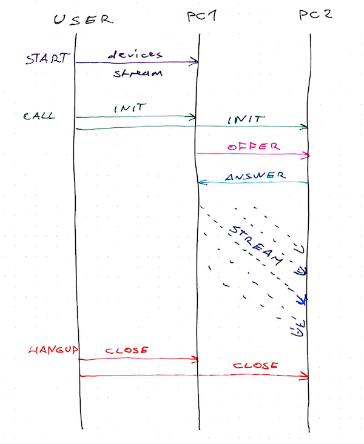

按照如下步骤在同一网页不同客户端之间建立连接

1. 实例化两个RTCPeerConnection对象。
2. 添加彼此为ICE candidates。
3. 对第一个对象使用createoffer建立请求。
4. 对两个对象设置本地/远程’描述’。
5. 对第二个对象createAnswer。
6. 对两个对象设置远程/本地’描述’。
7. 进行直接交流。

以下是代码实现

我们从一个react Component出发, 它可以传达两个视频和三个按钮, 并且有一些默认状态可供操作。

~~~ js
 1class WebRTCPeerConnection extends React.Component {
 2    state = {
 3        startDisabled: false,
 4        callDisabled: true,
 5        hangUpDisabled: true,
 6        servers: null,
 7        pc1: null,
 8        pc2: null,
 9        localStream: null
10    };
11    localVideoRef = React.createRef();
12    remoteVideoRef = React.createRef();
13
14    start = () => {
15        // start media devices
16    };
17
18    call = () => {
19        // initiate a call
20    };
21
22    hangUp = () => {
23        // hang up connection
24    };
25    render() {
26        const { startDisabled, callDisabled, hangUpDisabled } = this.state;
27        return (
28            

29                <video
30                    ref={this.localVideoRef}
31                    autoPlay
32                    muted
33                    style={{ width: "240px", height: "180px" }}
34                />
35                <video
36                    ref={this.remoteVideoRef}
37                    autoPlay
38                    style={{ width: "240px", height: "180px" }}
39                />
40                

41                    <button onClick={this.start} disabled={startDisabled}>
42                        Start
43                    </button>
44                    <button onClick={this.call} disabled={callDisabled}>
45                        Call
46                    </button>
47                    <button onClick={this.hangUp} disabled={hangUpDisabled}>
48                        Hang Up
49                    </button>
50                

51            

52        );
53    }
54}
~~~ 
我们使用三个布尔值来控制按钮: null 、 pc1 、 pc2。

第一步:开始
当点击Start开始按钮时,请求视频/音频许可并且开始一个localstream本地流。
~~~ js
 1    start = () => {
 2        this.setState({
 3            startDisabled: true
 4        });
 5        navigator.mediaDevices
 6            .getUserMedia({
 7                audio: true,
 8                video: true
 9            })
10            .then(this.gotStream)
11            .catch(e => alert("getUserMedia() error:" + e.name));
12    };
13    gotStream = stream => {
14        this.localVideoRef.current.srcObject = stream;
15        this.setState({
16            callDisabled: false,
17            localStream: stream
18        });
19    };
~~~
使用this.setState来禁止开始按钮,使用navigator.getUserMedia来进入媒体.如果允许,我们在localVideo中开始数据流并且把它加入到状态中。

第二步:调用
现在你可以按Call按钮,这样就启动了两点连接,pc1和pc2,使它们可以相互交流。
1.call开始请求。
2.onCreateOfferSuccess更新pc1,pc2,并且初始化应答。
3.onCreateAnswerSuccess结束连接。
4.gotRemoteStream激发建立第二个视频。
~~~ js
 1    call = () => {
 2        this.setState({
 3            callDisabled: true,
 4            hangUpDisabled: false
 5        });
 6        let { localStream } = this.state;
 7        let servers = null,
 8            pc1 = new RTCPeerConnection(servers),
 9            pc2 = new RTCPeerConnection(servers);
10        pc1.onicecandidate = e => this.onIceCandidate(pc1, e);
11        pc1.oniceconnectionstatechange = e => this.onIceStateChange(pc1, e);
12        pc2.onicecandidate = e => this.onIceCandidate(pc2, e);
13        pc2.oniceconnectionstatechange = e => this.onIceStateChange(pc2, e);
14        pc2.ontrack = this.gotRemoteStream;
15        localStream
16            .getTracks()
17            .forEach(track => pc1.addTrack(track, localStream));
18        pc1
19            .createOffer({
20                offerToReceiveAudio: 1,
21                offerToReceiveVideo: 1
22            })
23            .then(this.onCreateOfferSuccess, error =>
24                console.error(
25                    "Failed to create session description",
26                    error.toString()
27                )
28            );
29        this.setState({
30            servers,
31            pc1,
32            pc2,
33            localStream
34        });
35    };
~~~ 
这段代码几乎是前端模板。

我们开始或禁用相应的按钮,从状态中得到本地流localStream,并且初始化servers, pc1和pc2。

两个pc*都有许多事件听众，onIceCandidate会将其连接，并且通过onIceStateChange打印故障信息，gotRemoteStream会将其添加到正确的video组件。

接着我们把localStream添加到第一个客户端，pc1会产生一个接收视频和音频的请求，当完成这些之后，就更新了组分状态。

onCreateOfferSuccess
当pc1成功请求之后，我们更新客户端中本地和远程的描述。我不确定这些描述包括什么，但是这些资料很重要。
~~~ js
 1    onCreateOfferSuccess = desc => {
 2        let { pc1, pc2 } = this.state;
 3        pc1
 4            .setLocalDescription(desc)
 5            .then(
 6                () =>
 7                    console.log("pc1 setLocalDescription complete createOffer"),
 8                error =>
 9                    console.error(
10                        "pc1 Failed to set session description in createOffer",
11                        error.toString()
12                    )
13            );
14        pc2.setRemoteDescription(desc).then(
15            () => {
16                console.log("pc2 setRemoteDescription complete createOffer");
17                pc2
18                    .createAnswer()
19                    .then(this.onCreateAnswerSuccess, error =>
20                        console.error(
21                            "pc2 Failed to set session description in createAnswer",
22                            error.toString()
23                        )
24                    );
25            },
26            error =>
27                console.error(
28                    "pc2 Failed to set session description in createOffer",
29                    error.toString()
30                )
31        );
32    };
~~~ 
pc1更新本地描述，pc2更新远程描述，pc2同样产生了一个回复，就像这样：好，我接受你的请求，我们开始吧。

onCreateAnswerSuccess
当pc2成功回复后，我们开始建立另一轮描述，只不过这次顺序正好相反。
~~~ js
 1    onCreateAnswerSuccess = desc => {
 2        let { pc1, pc2 } = this.state;
 3        pc1
 4            .setRemoteDescription(desc)
 5            .then(
 6                () =>
 7                    console.log(
 8                        "pc1 setRemoteDescription complete createAnswer"
 9                    ),
10                error =>
11                    console.error(
12                        "pc1 Failed to set session description in onCreateAnswer",
13                        error.toString()
14                    )
15            );
16        pc2
17            .setLocalDescription(desc)
18            .then(
19                () =>
20                    console.log(
21                        "pc2 setLocalDescription complete createAnswer"
22                    ),
23                error =>
24                    console.error(
25                        "pc2 Failed to set session description in onCreateAnswer",
26                        error.toString()
27                    )
28            );
29    };
~~~ 
pc1建立远程描述而pc2建立本地描述。我想这就像是：从pc1视角看来，对它是本地的，对pc2是远程的，反过来对pc2也一样。
现在，我们就有了两个视频流，可以在同一个网页中相互交流。

onIceCandidate
在这一步，两个pc都说它们得到了ICE candidate。我不知道实际发生了什么，但是这给了我们一个来区分这两个客户端分别在对谁交流的机会。
~~~ js
 1    onIceCandidate = (pc, event) => {
 2        let { pc1, pc2 } = this.state;
 3        let otherPc = pc === pc1 ? pc2 : pc1;
 4        otherPc
 5            .addIceCandidate(event.candidate)
 6            .then(
 7                () => console.log("addIceCandidate success"),
 8                error =>
 9                    console.error(
10                        "failed to add ICE Candidate",
11                        error.toString()
12                    )
13            );
14    };
~~~ 
我们猜测其它客户端，把它添加成为一个candidate。 如果我们的客户端多于两个，这会很有意思。

第三步：结束
结束很简单，只需要关闭两个客户端。
~~~ js
 1    hangUp = () => {
 2        let { pc1, pc2 } = this.state;
 3        pc1.close();
 4        pc2.close();
 5        this.setState({
 6            pc1: null,
 7            pc2: null,
 8            hangUpDisabled: true,
 9            callDisabled: false
10        });
11    };
~~~ 
有趣的地方
第一部分连接，也就是两个客户端互相找到对方，成为发射信号。WebRTC spec没有提到发信号。

发信号在同一个网页两个客户端之间是很简单的，两个客户端就在内存中，只需要启动两个客户端。

但是在现实世界中，你需要这些客户端可以在不同计算机的不同浏览器中运行，如何做才能使它们能互相找到对方呢？如果有上千个客户端呢？

你需要一些通信频道，这些频道知道所有客户端在哪儿，并且说：嗨！你，连接我这里，或者是，你，离开我这里。

这对分布式去中心化区块链不起作用。

## WebRTC对等连接（二）- 连接不同设备上的浏览器 [(原文出处)](https://webrtc.org.cn/20180612_conect_browsers/)
### WebRTC对等通信-在不同设备上连接浏览器
我们成功了！不需要服务器即可使不同设备上的两个浏览器相互交流，只需要在开始交互的时候使用服务器。
点击此处运行代码，在不同的设备上打开两个链接。

### 如何使用WebRTC连接不同设备上的浏览器
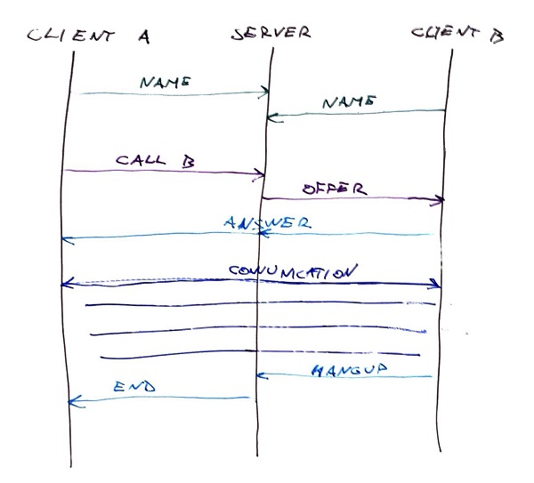
你可以使用WebRTC在无服务器时使浏览器相互交流，但是由于没有服务发现，我们需要一个发信服务器来使浏览器可以找到彼此。

步骤如下：
1. 客户端1 对服务器说hi并注册。
2. 客户端2 对服务器说hi并注册。
3. 服务器记录身份信息（用户名）
4. 客户端1命令服务器呼叫客户端2
5. 服务器告诉客户端2有呼叫信息。
6. 客户端2接收呼叫。
7. 客户端1和2直接交流。

我们模仿MDN的WebRTC交流实例来形成代码框架。
### WebSocket信令服务器
发信号是两个浏览器之间的交互过程，我们使用了WebSockets来完成。

服务器部分和MDN的例子相同，只需复制。

我们做出了一些改变使它可以对now.sh项目工作。名称上，我们移除了所有SSL部分。Zeit将我们的服务器包进一个安全的SSL 服务器，SSL服务器接着通过一个非加密连接与实际服务器进行交流。

如果没有SSL，WebSockets不能在现代浏览器中起作用。如果没有运行本地主机，它对自签名证书不工作。如果需要两个不在本地设备上的浏览器交流，必须确保一个SSL证书。
最简单的方法是在now项目上进行。

### 连接信令服务器
通过40行helper类的WebSockets可以与服务器交流。实例化类，建立连接，收听信息。
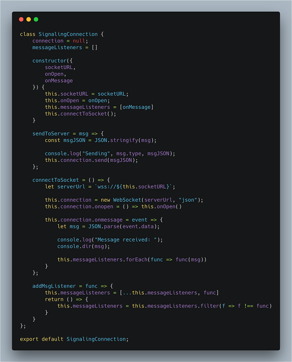
我们在connetToSocket中建立了一个new WebSocket,加入一些反馈，期待好的效果。Onmessage允许我们之后通过messageListeners数组添加额外的message listeners 窗口。

SendToServer 允许向服务器发送JSON对象，并且addMsgListener允许添加一个新的message listener 窗口。 我们使用它来连接PeerConnection 和服务器。
### 建立PeerConnection接口
从WebRTC part1 可以学到， 我们把RTCPeerConnection组件分成了help class。

以下148行代码完成了整个周期。我们之前讨论过此代码，这是重述。
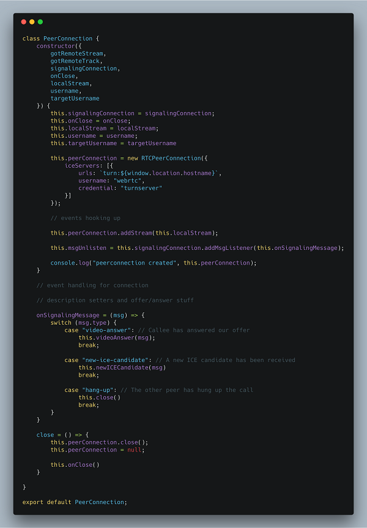
Constructor建立了一些实例变量，一个新的RTCPeerConnection对象，告诉它用哪个iceServers,连接本地event listeners，然后开始接受信令服务器信息，并添加媒体流到peerConnection.

下一步是处理ICECandidate,当有新连接时它将建立一个的交互连接。它会ping信令服务器，告诉信令服务器，这里有新的ICE candidate.
~~~js
  handleICECandidateEvent = event => {
        if (event.candidate) {
            this.signalingConnection.sendToServer({
                type: "new-ice-candidate",
                target: this.targetUsername,
                candidate: event.candidate
            });
        }
    };
~~~
这之后，我们得到了handleNegotiationNeededEvent,当RTCPeerConnection需要新连接时，它会被调用。（我也不知道是什么触发了它）

但是函数产生了一个新的连接请求，更新了本地SDP描述，并且告知信令服务器它在尝试连接。
~~~js
     handleNegotiationNeededEvent = () => {
        const {
            username,
            targetUsername
        } = this;
        this.peerConnection
            .createOffer()
            .then(offer => this.peerConnection.setLocalDescription(offer))
            .then(() =>
                this.signalingConnection.sendToServer({
                    name: username,
                    target: targetUsername,
                    type: "video-offer",
                    sdp: this.peerConnection.localDescription
                })
            )
            .catch(console.error);
    };
~~~
### 处理信令消息
接着到了有趣的部分，处理信令服务器的消息。
~~~js
  onSignalingMessage = (msg) => {
        switch (msg.type) {
            case "video-answer": // Callee has answered our offer
                this.videoAnswer(msg);
                break;
            case "new-ice-candidate": // A new ICE candidate has been received
                this.newICECandidate(msg)
                break;
            case "hang-up": // The other peer has hung up the call
                this.close()
                break;
        }
    }
~~~
当接收新信息时，我们可以做许多事。把我们自己设置成接收方，向连接中添加新的candidate或关闭。

~~~js
  videoAnswer = ({
        sdp
    }) => {
        this.peerConnection
            .setRemoteDescription(new RTCSessionDescription(sdp))
            .catch(console.error);
    }
    newICECandidate = ({
        candidate
    }) => {
        this.peerConnection.addIceCandidate(new RTCIceCandidate(candidate));
    }

   close = () => {
        this.peerConnection.close();
        this.peerConnection = null;
        this.onClose()
    }
~~~
这就是我们的PeerConnection对象。理论上，我们可以实例化许多PeerConnection对象来同时连接远端机器。

这将会是一个有趣的尝试。
### 将所有部件整合
把这些组合起来的，就是我们的WebRTCPeerConnectionWithServer反应组件,经过用户界面，实例化helper类，处理用户点击按钮的过程。

点击此处查看GitHub完整文件。

以下是其中比较重要的部分：
~~~js
 call = user => {
        this.setState({
            targetUsername: user
        });
        this.createPeerConnection();
    };
    hangUp = () => {
        this.signalingConnection.sendToServer({
            name: this.state.username,
            target: this.state.targetUsername,
            type: "hang-up"
        });
        this.peerConnection.close();
    };
    createPeerConnection = () => {
        if (this.peerConnection) return;
        this.peerConnection = new PeerConnection({
            gotRemoteStream: this.gotRemoteStream,
            gotRemoteTrack: this.gotRemoteTrack,
            signalingConnection: this.signalingConnection,
            onClose: this.closeVideoCall,
            localStream: this.state.localStream,
            username: this.state.username,
            targetUsername: this.state.targetUsername
        });
    };
    closeVideoCall = () => {
        this.remoteVideoRef.current.srcObject &&
            this.remoteVideoRef.current.srcObject
                .getTracks()
                .forEach(track => track.stop());
        this.remoteVideoRef.current.src = null;
        this.setState({
            targetUsername: null,
            callDisabled: false
        });
    };
~~~
函数从call开始启动，保存我们正在调用的状态，建立一个新的peer连接。

CreatePeerConnection把所有信息传入PeerConnection类。

HangUp和closeVideoCall共同工作来停止调用。我们需要两者因为其中一个是用户控制的，而当挂断命令从另一边传来的时候，另一个被调用。
### 最后一步
在粘合区有一条信令服务器发出的信息需要我们处理： 调用请求。

~~~js
    case "video-offer": // Invitation and offer to chat
        this.createPeerConnection();
        this.peerConnection.videoOffer(msg);
        break;
~~~
当服务器告知需要连接时，我们需要在客户端创建一个新的PeerConnection对象，并处理请求。处理请求意味着设置一个远程SDP描述并发送应答。
~~~js
 videoOffer = ({
        sdp
    }) => {
        const {
            username,
            targetUsername
        } = this;
        this.peerConnection
            .setRemoteDescription(new RTCSessionDescription(sdp))
            .then(() => this.peerConnection.createAnswer())
            .then(answer => {
                return this.peerConnection.setLocalDescription(answer);
            })
            .then(() => {
                this.signalingConnection.sendToServer({
                    name: username,
                    targetUsername: targetUsername,
                    type: "video-answer",
                    sdp: this.peerConnection.localDescription
                });
            })
            .catch(console.error);
    }
~~~
### 成功工作
将所有部分结合，现在你可以在不同设备的两个浏览器上相互交流而不再需要服务器。

## 使用getDisplayMedia实现在Chrome中屏幕共享 [(原文出处)](https://webrtc.org.cn/20180704-chrome-extension-getdisplaymedia-screencapture/)
### 使用getDisplayMedia实现在Chrome中屏幕共享
Chrome网上商店已经决定停止允许Chrome扩展部件的内联安装，这对WebRTC应用有着极大的影响，因为目前在Chrome中屏幕共享需要扩展部件。GetDisplayMedia API 能不能解决这个问题呢？
### Chrome中屏幕共享
当Chrome33中引入屏幕共享时，需要扩展部件来解决安全问题。这比之前的做法更好，之前的做法是将这种能力置于一个标志之后，这个标志允许用户根据需求修改。

自2003年之后，Chrome没有做出太大改变。需要扩展部件增加了与屏幕共享过程的摩擦，但是由于内联安装，这种摩擦被最大限度的减小了:

1. 用户点击按钮开始屏幕共享。
2. Web应用检测Chrome并确定出未安装的扩展部件。
3. Web应用触发内联安装API,获得成功回调。
4. Chrome桌面、窗口、标签共享选择器弹出，允许用户选择共享哪部分。

关于全部实现请查看getScreenMedia 扩展示例。

共享选择器是这里的关键部分，没有web商店安全网的时候，暴露给Web平台，这足够安全吗？

2

在这个计划中共享标签是个主要关注点，因为它能分解跨域沙盒。

### Firefox中的屏幕共享
Firefox使用了不同的方法，建立了一个白名单记录允许使用这个API的网站。这个过程包括向Mozilla询问并展示此网站有服务条款和隐私政策。你可以通过扩展部件来修改此白名单。在Firefox52，移除了此白名单，允许任何安全来源使用屏幕共享。它没有使用getDisplayMedia API，但是实现几乎相同，我们之后会讲到。

~~~js
navigator.mediaDevices.getUserMedia({video: {mediaSource: 'screen'}})
  .then(stream => {
    // we have a stream, attach it to a feedback video element
    videoElement.srcObject = stream;
  }, error => {
    console.log("Unable to acquire screen capture", error);
  });
~~~
这将会被更新来支持最终说明。

### GetDisplayMedia API
W3C一直致力于对屏幕捕捉API的标准化。像getUserMedia一样，简单，基于承诺。

来自示例1的屏幕捕捉API说明
~~~js
navigator.getDisplayMedia({ video: true })
  .then(stream => {
    // we have a stream, attach it to a feedback video element
    videoElement.srcObject = stream;
  }, error => {
    console.log("Unable to acquire screen capture", error);
  });
  ~~~
微软Edge在今年的早期刚刚使用这个API实现了屏幕共享。用户体验极好，添加了一个黄色的边界，来显示用户正在共享的界面，确保用户时刻知道他们在分享哪些部分。

### Chrome扩展部件带来了变化
根据实际来讲，appear.in 屏幕共享扩展像先前描述的一样，在上百万次数安装中非常成功。
用户中的绝大多数来自内联安装，因此我们不厌其烦的更新自2014年的Chrome Web商店中扩展屏幕的部件。

目前Chrome Web商店移除了内联安装。这在我学习一个旧版本Chrome关于让屏幕共享更广泛的应用的问题的时候，感到意外。（感谢Wilhelm Wanecek指出这点）。

如果我正确的理解了声明，这将会在不同的标签中打开Chrome Web商店。这将会使检测用户何时从Web App中安装了扩展部件变得困难。帖子上的时间表如下：
1. 自6.12起，新扩展部件不需要内联安装。无通知期限。
2. 对已经存在的扩展部件的内联安装将会在9.12禁止，三个月通知期限。

### 抱怨
有几件事是错误的。我甚至没有讨论Google Hangouts/Meet,完全避免了其他人为了使用内置扩展来应对的用户体验。

我期待着Chrome Webstore团队的一些推广延伸。Appear.in扩展被上百万用户当做最大的屏幕共享扩展部件之一。我们的用户与网站建立了信任关系，通常允许我们传输网络摄像头和麦克风。使用基于此信任关系的内联安装比从Chrome WebStore安装更安全。同样我们要求WebStore开发人员对我们拆除由数百名用户安装的扩展程序的非法拷贝进行支持。

Google的WebRTC小伙伴们同样提出了很好的建议。

### 转到getDisplayMedia
Chrome的前进道路致力于getDisplayMedia API. 消息传出来不久，intent to ship就发布了。然而，考虑到Chrome的发布周期，这将会需要几周的时间来实现。对于安全性和用户的体验来说这是一个不小的变化，以至于在9.12日截止日前之前让人感到怀疑。Chrome69在9.12日发布的稳定分支点只有不到一个月时间了。

Chrome中的情况更加复杂，因为它允许共享标签，同时限制用户可以选择的界面。Chrome支持的共享音频输出也没有被getDisplayMedia指定。

### 如何应对Chrome的最终改变
实际上关于支持getDisplayMedia部分的代码变化相对简单。这个API 和你使用Firefox的带有mediaSource 参数的getUserMedia call会进入相同的位置。通过检测getDisplayMedia的存在可以轻易的完成特征检测。

~~~js
if ('getDisplayMedia' in window.navigator) {
  // use it.
} else {
  // fall back to extension way
}
~~~
某种程度上，如何指定capture frame rate仍然不清晰。在MediaStreamTrack上使用applyConstraints返回对getUserMedia的工作，并且可能会继续对getDisplayMedia执行同样的操作。
~~~js
navigator.getDisplayMedia({video: true})
  .then(stream => {
    stream.getTracks()[0].applyConstraints({frameRate: 5});
    return stream;
  })
  ~~~
详细信息请查看具体问题部分。

不幸的是，adapter.js不能真正的获取getDisplayMedia，因为与扩展部分的通信交流不是完全相同，不同的扩展有轻微的差异。

### 目前与展望
我期待着看到Google的WebRTC小伙伴影响移除内联扩展或及时发布getDisplayMedia的截止时间。有时候Web平台的建立可能会很麻烦，但是通常最终会取得很好的结果。我们期待着这次的结束，也将会高兴的与扩展部分告别。

## 教程：如何使用WebRTC建立一个视频会议App(一) [(原文出处)](https://webrtc.org.cn/20180729-webrtc-nattraversal-signaling/)
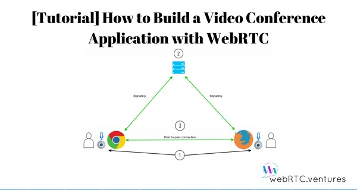
本篇博文将会提供一个关于如何使用WebRTC建立一个视频会议App的教程。

我们不会将其设计的太复杂，它将会是一个简单的一对一视频会议App，并且仅仅使用了WebRTC APIs和一些其他的library来建立一个信令服务器。

在开始之前，让我们首先进行一个快速摘要简述。

为此我们应该观察如下WebRTC通信过程的图。

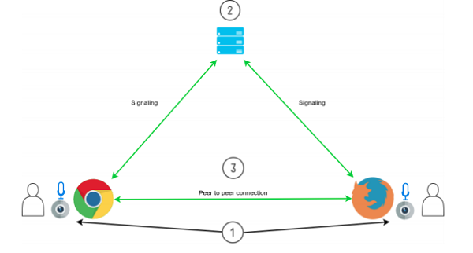

WebRTC的通信过程可以看成如下三步：
1. 浏览器获取媒体设备（摄像头和麦克风）。
2. 通过信令过程，每一个peer和其它所有peer交换信息。
3. 发信之后，peers可以直接连接，并开始通信交流。

为了实现这个过程，对于交换信息需要一个信令服务器。同样需要一对STUN/TURN服务器来实现NAT穿透。并且在不能直接通信的情况下传递媒体。

让我们转到App设计的部分。

### App
就如之前所说，我们将会建立一个简单的一对一视频会议App.它将会有一个房间功能，在每个房间将会主持不同的会议。

用户首先看到一个需要输入房间号的屏幕界面，可以是用户想去的任意一个房间，接着当另一个用户想要加入的时候，他可以输入同样的房间号来开始交流通话。

此教程的代码在Github的一个公共目录下可以查到，你可以克隆到你的电脑上或跟着文章在纸上描绘出来。

我们使用了JavaScript作为编程语言，Node.JS作为运行引擎，所以如果你没有的话可以安装它。

让我们从创建一个文件夹开始，这将会是我们的项目文件夹。接着在里面创建另一个名字叫做public的文件夹。现在使用命令行，转到项目文件夹并将如下命令粘贴到命令行里来安装所需。为了下载library需要确保网络连接正常。
~~~ bash
npm init -y
npm install -S express@4.15.4 socket.io@2.0.3
~~~
现在让我们创建一个简单的html文件。它将会包含两个div元素，一个为了输入房间号，另一个为了显示视频流。这个文件也会包含socket.io客户端library脚本标签，另一个文件我们之后会创建。

使用你最喜爱的文本编辑器，创建一个新文件，粘贴如下代码并且保存在项目文件夹中，在public文件夹里保存为index.html文件。

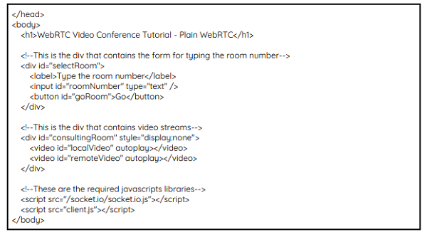

很棒。下一步是创建一个客户端的javascript文件。在这个文件中将会得到网页元素就像div元素的引用，用户用来输入房间号的输入文本，用户点击的按钮，等等。接着我们声明一些全局变量来存储像房间号，本地和远程视频音频流，和点点连接对象和使用的TURN/STUN服务器。

我们还会连接到socket.io服务器并添加一个点击按钮的事件，在这个事件中，我们向服务器发送一条创建或加入的信息。粘贴如下代码到新文件中并且在public文件夹下保存为client.js文件。

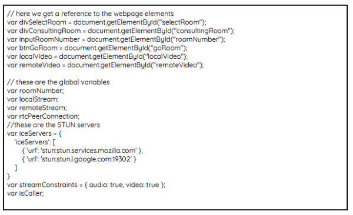

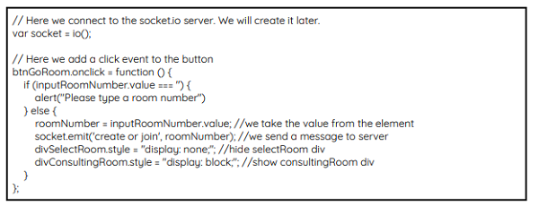

在向服务器发送了初始信息之后，我们需要等待响应，我们可以在同一个client.js文件中建立一些event handlers.

当第一个参与者加入了会话，服务器创建一个新房间接着发送给用户‘’加入‘’事件。接着对第二个参与者同样如此：浏览器获取媒体设备，存储视频音频流，在屏幕上展示视频，但是发生了另一个动作，一条‘’准备好了‘’的信息发送到了服务器端。添加如下代码到client.js文件底部。

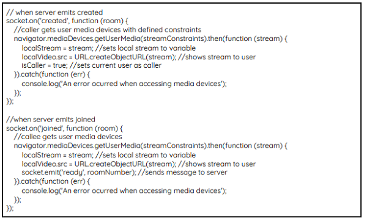

到目前为止第一步完成。

## 教程：如何使用WebRTC建立一个视频会议App(二) [(原文出处)](https://webrtc.org.cn/20180729-webrtc-signaling-nattraversal/)

当第一个参与者接收到准备好了的信息时，它的反馈创建了一个RTCPeerConnection对象，设置对象的onicecandidate和onaddstream listeners为相应的onIceCandidate和onAddStream函数，我们之后将会重温这些函数。最终它将本地流添加到了peer connection对象中。之后它准备一个请求，请求存储在本地并通过setLocalAndOffer函数发送到服务器端。

服务器传递请求到第二个参与者，第二个参与者反过来在请求反馈方面做了同样的事：创建了它自己的peer connection对象并且设置事件听众，接着存储请求准备一个将会存储在本地的应答，接着通过setLocalAndAnswer函数发送到服务器端。

和请求相似，服务器会将回答传递给第一个参与者。当发生这些时，两个peers就在通过向服务器发送candidate信息交换icecandidates，服务器反过来传递它们给其它客户端。Ice candidates被添加到每一个客户端的peer connection 对象中。将如下代码添加到client.js文件中。

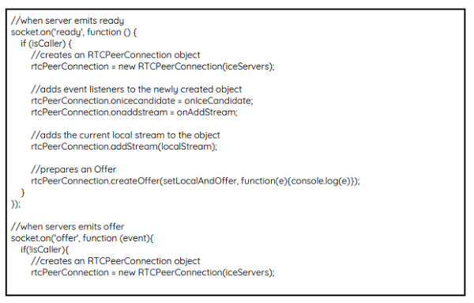

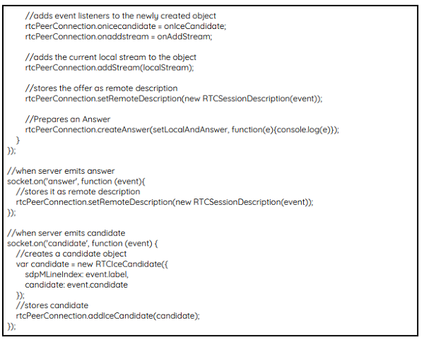

第二步就此完成。

当一切准备就绪后，每一个peer接收远程流，接着onAddStream函数将会将它显示在屏幕上。以下是client.js文件中的函数。

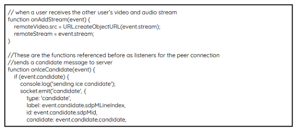

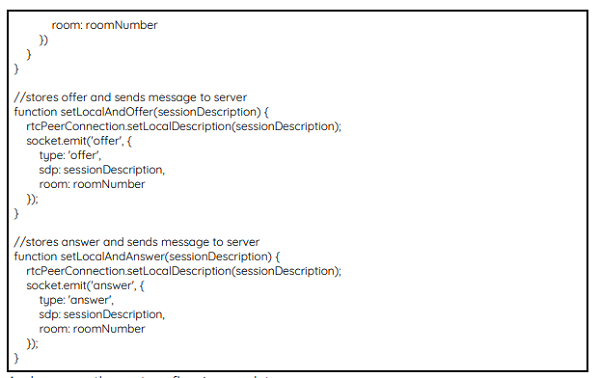

现在我们完成了第三步。

然而我们的服务器还没有完成。我们从询问所需的library开始，并且在public文件夹中设置static host来服务客户端文件。

接着我们使用socket.io定义信号处理 程序。首先我们会得到创建或加入事件，它们会统计房间中客户端的数量。如果没有用户说明客户端是第一个peer，因此向它发送一个创建事件。如果房间中已经存在了一个参与者，那么客户端会被添加到房间中，并且向它发送加入事件。如果房间中已经有两个用户，那么这被认为是房间满了的情况，因此不需要再添加客户端。

这一连串的事件都是按照传递顺序工作的，向房间中其它客户端发送接收到的同样的信息。创建一个新文件，粘贴如下代码并保存它到项目文件夹下，名为server.js.

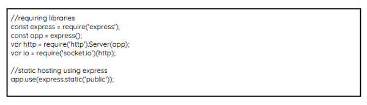

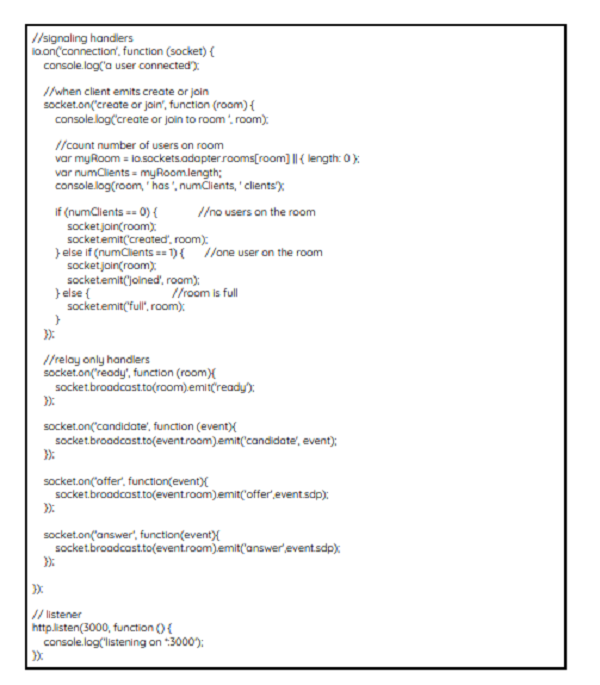

既然我们已经具备了所有所需的文件，我们已经准备好测试我们的应用了。在命令行，进入项目文件夹中并且输入如下命令：
~~~bash
node server.js
~~~
接着使用 Google Chrome or Mozilla Firefox,将此链接在两个标签下打开，确保你都输入了同样的房间号。

是不是很酷？

我们已经创建了我们的第一个视频会议App.
##  [(原文出处)]()
##  [(原文出处)]()
## WebRTC带宽估计[(原文出处)](https://webrtc.org.cn/uses-of-datachannel/)
## WebRTC带宽估计[(原文出处)](https://webrtc.org.cn/uses-of-datachannel/)
## WebRTC带宽估计[(原文出处)](https://webrtc.org.cn/uses-of-datachannel/)
~~~js
~~~
~~~js
~~~
~~~js
~~~
~~~js
~~~
~~~js
~~~